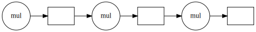
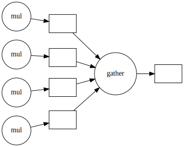

# Common problems

> ## What problems are we solving?
> Ask around what problems participants encountered: "Why did you sign up?"
{: .discussion}

Most problems will fit in one of two categories:
- I wrote this code in Python and it is not fast enough.
- I run this code on my laptop, but the target problem size is bigger than the RAM.

In this course we will show several possible ways of speeding up your program and making it ready
to function in parallel. We will be introducing the following modules:

1. `threading` allows different parts of your program to run concurrently on a single computer (with shared memory)
3. `dask` makes scalable parallel computing easy
4. `numba` speeds up your Python functions by translating them to optimized machine code
5. `memory_profile` monitors memory performance
6. `asyncio` Python's native asynchronous programming

FIXME: Actually explain functional programming & distributed programming
More importantly, we will show how to change the design of a program to fit parallel paradigms. This
often involves techniques from **functional programming**.

> ## What we won't talk about
> In this course we will not talk about **distributed programming**. This is a huge can of worms. It is easy to
show simple examples, but depending on the problem, solutions will be wildly different. Dask has a
lot of functionality to help you in setting up for running on a network. The important bit is that,
once you have made your code suitable for parallel computing, you'll have the right mind-set to get
it to work in a distributed environment.
{: .callout}


# FIXME: Overview and rationale
This is an advanced course. Why is it advanced? We (hopefully) saw in the discussion that although
many of your problems share similar characteristics, it is the detail that will determine the
solution. We all need our algorithms, models, analysis to run in a way that many hands make light
work. When such a situation arises with a group of people, we start with a meeting discussing who
does what, when do we meet again to sync up, etc. After a while you can get the feeling that all you
do is be in meetings. We will see that there are several abstractions that can make our life easier.
In large parts this course will use Dask to illustrate these abstractions.

- Vectorized instructions: tell many workers to do the same work on a different piece of data. This
  is where `dask.array` and `dask.dataframe` come in. We will illustrate this model of working by
computing the number Pi later on.
- Map/filter/reduce: this is a method where we combine different functionals to create a larger
  program. We will use `dask.bag` to count the number of unique words in a novel using this
formalism.
- Task-based parallelization: this may be the most generic abstraction as all the others can be expressed
  in terms of tasks or workflows. This is `dask.delayed`.

# Why Python?
Python is one of most widely used languages to do scientific data analysis, visualization, and even modelling and simulation.
The popularity of Python is mainly due to the two pillars of a friendly syntax together with the availability of many high-quality libraries.

> ## It's not all good news
> The flexibility that Python offers comes with a few downsides though:
> - Python code typically doesn’t perform as fast as lower-level implementations in C/C++ or Fortran.
> - It is not trivial to parallelize Python code to work efficiently on many-core architectures.
>
> This workshop addresses both these issues, with an emphasis on being able to run Python code efficiently (in parallel) on multiple cores.
{: .callout}
# What is parallel computing?

## Dependency diagrams

Suppose we have a computation where each step **depends** on a previous one. We can represent this situation like in the figure below, known as a dependency diagram:


In these diagrams the inputs and outputs of each function are represented as rectangles. The inward and outward arrows indicate their flow. Note that the output of one function can become the input of another one. The diagram above is the typical diagram of a **serial computation**. If you ever used a loop to update a value, you used serial computation.

If our computation involves **independent work** (that is, the results of the application of each function are independent of the results of the application of the rest), we can structure our computation like this:


This scheme corresponds to a **parallel computation**.

### How can parallel computing improve our code execution speed?

Nowadays, most personal computers have 4 or 8 processors (also known as cores). In the diagram above, we can assign each of the three functions to one core, so they can be performed simultaneously.

> ## Do 8 processors work 8 times faster than one?
> It may be tempting to think that using eight cores instead of one would multiply the execution speed by eight. For now, it's ok to use this a first approximation to reality. Later in the course we'll see that things are actually more complicated than that.
{: .callout}

## Parallelizable and non-parallelizable tasks
Some tasks are easily parallelizable while others inherently aren't. However, it might not always be immediately
apparent that a task is parallelizable.

Let us consider the following piece of code.
~~~python
x = [1, 2, 3, 4] # Write input

y = 0 # Initialize output

for i in range(len(x)):
  y += x[i] # Add each element to the output variable

print(y) # Print output
~~~
{: .source}

Note that each successive loop uses the result of the previous loop. In that way, it is dependent on the previous
loop. The following dependency diagram makes that clear:



Although we are performing the loops in a serial way in the snippet above,
nothing avoids us from performing this calculation in parallel.
The following example shows that parts of the computations can be done independently:

```python
x = [1, 2, 4, 4]

chunk1 = x[:2]
chunk2 = x[2:]

sum_1 = sum(chunk1)
sum_2 = sum(chunk2)

result = sum_1 + sum_2

print(result)
```



There is a subclass of problems where the subtasks are completely independent. These kinds of problems are known as
[embarrassingly parallel](https://en.wikipedia.org/wiki/Embarrassingly_parallel).

An example of this kind of problem is squaring each element in a list, which can be done like so:
~~~python
y = [n**2 for n in x]
~~~
{: .source}
Each task of squaring a number is independent of all the other elements in the list.

It is important to know that some tasks are fundamentally non-parallelizable.
These tasks are also known as **inherently serial**. An example could be the computation of the fibonacci sequence
using the formula `Fn=Fn-1 + Fn-2`. Each output here depends on the outputs of the two previous loops.

## Challenge: Parallellizable and non-parallellizable tasks
Can you think of a task in your domain that is parallelizable? Can you also think of one that is fundamentally
non-parallelizable?

Please write your answers in the collaborative document.

> ## Embarrassingly parallel problems
> Although we talked about embarrassingly parallel problems, it would be more correct to talk about
embarrassingly parallel algorithms.
>
> Often, the parallelizability of a problem depends on its specific implementation. For instance, in our
first example of a non-parallelizable task, we mentioned the calculation of the factorial of 4 using
the algorithm of multiplying, one by one, by all the integers below that number (that is, 4, 3, 2, 1).
If, instead, we use another algorithm, such as the [gamma function](https://en.wikipedia.org/wiki/Gamma_function#Motivation), the same problem accepts parallelization.
>
> Last but not least, don't let the name demotivate you: if your algorithm happens to be embarrassingly parallel, that's good news! The "embarrassingly" refers to the feeling of "this is great!,
how did I not notice before?!"
{: .callout}


> ## Challenge: Parallelised Pea Soup
> We have the following recipe:
> 1.  (1 min) Pour water into a soup pan, add the split peas and bay leaf and bring it to boil.
> 2. (60 min) Remove any foam using a skimmer and let it simmer under a lid for about 60 minutes.
> 3. (15 min) Clean and chop the leek, celeriac, onion, carrot and potato.
> 4. (20 min) Remove the bay leaf, add the vegetables and simmer for 20 more minutes. Stir the soup
occasionally.
> 5.  (1 day) Leave the soup for one day. Reheat before serving and add a sliced smoked
>     sausage (vegetarian options are also welcome). Season with pepper and salt.
>
> Imagine you're cooking alone.
> - Can you identify potential for parallelisation in this recipe?
> - And what if you are cooking with the help of a friend help? Is the soup done any faster?
> - Draw a dependency diagram.
>
> > ## Solution
> > - You can cut vegetables while simmering the split peas.
> > - If you have help, you can parallelize cutting vegetables further.
> > - There are two 'workers': the cook and the stove.
> > 
> {: .solution}
{: .challenge}


