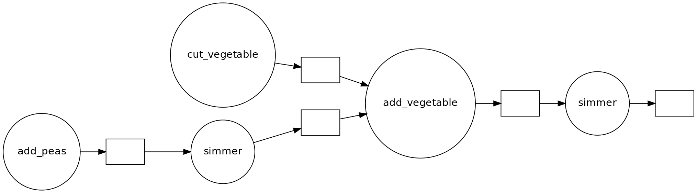

# Common problems

> ## What problem(s) are we solving?
> Ask around what problems participants encountered, "why did you sign up?".
{: .discussion}

Most problems will fit in one of two categories:
- I wrote this code in Python and its not fast enough.
- I run this code on my Laptop, but the target problem size is bigger than the RAM.

In this course we will show several possible ways of speeding up your program and making it ready
to function in parallel. We will be introducing the following modules

1. `threading` standard library module that allows different parts of your program to run concurrently on a single computer (with shared memory)
3. `dask` makes scalable parallel computing easy
4. `numba` speed up your python functions by translating them to optimized machine code
5. `memory_profile` monitor memory performance

FIXME: Actually explain functional programming & distributed programming
More importantly, we will show how to change the design of a program to fit parallel paradigms. This
often involves techniques from **functional programming**.

What we won't talk about: **distributed programming**, this is a huge can of worms. It is easy to
show simple examples, but depending on the problem, solutions will be wildly different. Dask has a
lot of functionality to help you in setting up for running on a network. The important bit is that,
once you have made your code suitable for parallel computing, you'll have the right mind-set to get
it to work in a distributed environment.

# What is parallel computing?
Suppose we have a computation, where each step **depends** on a previous one:

~~~python
def f(x):
    return x + 1

x = 0
for i in range(10):
  x = f(x)
print(x)
~~~
{: .source}

This computation is **inherently serial**. We can show a diagram showing the dependencies for each function
call:

If however, the computation involves **independent work**, we can do things in **parallel**:

~~~python
for i in range(n):
  x[i] = f(some_input[i])
print(collect(x))
~~~
{: .source}

Now the **dependency graph** looks different

> ## Challenge: Parallelised Pea Soup
> We have the following recipe:
> 1.  (1 min) Pour water into a soup pan, ad the split peas and bay leaf and bring it to boil.
> 2. (60 min) Remove any foam using a skimmer and let it simmer under a lid for about 60 minutes.
> 3. (15 min) Clean and chop the leek, celeriac, onion, carrot and potato.
> 4. (20 min) Remove the bay leaf, add the vegetables and simmer for 20 more minutes; stir the soup
occasionally.
> 5.  (1 day) Leave the soup for one day. Reheat before serving and add a sliced (vegetarian) smoked
>     sausage, season with pepper and salt.
>
> Can you identify potentials for parallelisation in this recipe? If you're cooking alone, and what
> if you have help? Is the soup done any faster? Draw a dependency diagram.
>
> > ## Solution
> > - You can cut vegetables while simmering the split peas.
> > - If you have help, you can parallelize cutting vegetables further.
> > - There are two 'workers': the cook and the stove.
> > 
> {: .solution}
{: .challenge}



