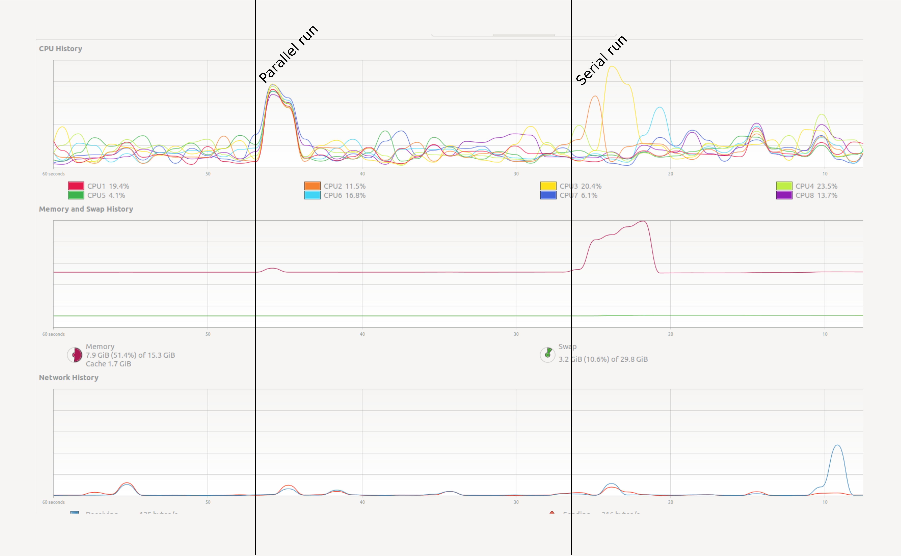

# A first example with Dask
We will get into creating parallel programs in Python later. First let's see a small example. Open
your system monitor, and run the following code examples.

~~~python
# Summation making use of numpy:
import numpy as np
result = np.arange(10**7).sum()
~~~
{: .source}

~~~python
# The same summation, but using dask to parallelize the code.
# NB: the API for dask arrays mimics that of numpy
import dask.array as da
work = da.arange(10**7).sum()
result = work.compute()
~~~
{: .source}

> ## Try a heavy enough task
> It could be that a task this small does not register on your radar. Depending on your computer you will 
have to raise the power to ``10**8`` or ``10**9`` to make sure that it runs long enough to observe the effect.
But be careful and increase slowly. Asking for too much memory can make your computer slow to a crawl.
{: .callout}

How can we test this in a more practical way? In Jupyter we can use some line magics, small "magic words" preceded
by the symbol `%%` that modify the behaviour of the cell.

~~~python
%%time
np.arange(10**7).sum()
~~~
{: .source}

This was only a single run, how can we trust this?

The `%%time` line magic checks how long it took for a computation to finish. It does nothing to
change the computation itself. In this it is very similar to the `time` shell command.

The `%%timeit` line magic, however, first measures how long it takes to run a command one time, then
repeats it enough times to get an average run-time. Also, `%%timeit` can measure run times without
the time it takes to setup a problem, measuring only the performance of the code in the cell.
This way we can trust the outcome better.

~~~python
%%timeit
np.arange(10**7).sum()
~~~
{: .source}

Note that this does not tell you anything about memory consumption or efficiency.

# Memory profiling
The act of systematically testing performance under different conditions is called **benchmarking**.
Analysing what parts of a program contribute to the total performance, and identifying possible
bottlenecks is **profiling**. 

We will use the [`memory_profiler` package](https://github.com/pythonprofilers/memory_profiler) to track memory usage.
It can be installed executing the code below in the console:

~~~sh
pip install memory_profiler
~~~
{: .source}

In Jupyter, type the following lines to compare the memory usage of the serial and parallel versions of the code presented above (again, change the value of `10**7` to something higher if needed):
~~~python
import numpy as np
import dask.array as da
from memory_profiler import memory_usage
import matplotlib.pyplot as plt

def sum_with_numpy():
    # Serial implementation
    np.arange(10**7).sum()

def sum_with_dask():
    # Parallel implementation
    work = da.arange(10**7).sum()
    work.compute()

memory_numpy = memory_usage(sum_with_numpy, interval=0.01)
memory_dask = memory_usage(sum_with_dask, interval=0.01)

# Plot results
plt.plot(memory_numpy, label='numpy')
plt.plot(memory_dask, label='dask')
plt.xlabel('Time step')
plt.ylabel('Memory / MB')
plt.legend()
plt.show()
~~~
{: .source}

# Alternate Profiling

Dask has a couple of profiling options as well.

~~~python
from dask.diagnostics import Profiler, ResourceProfiler
work = da.arange(10**7).sum()
with Profiler() as prof, ResourceProfiler(dt=0.001) as rprof:
    result2 = work.compute()

from bokeh.plotting import output_notebook
from dask.diagnostics import visualize
visualize([prof,rprof], output_notebook())
~~~
FIXME: somehow the visualisation turns up in a separate file and in the notebook, I cannot disable the separate file atm.

~~~python
with ResourceProfiler(dt=0.001) as rprof2:
    result = np.arange(10**7).sum()
visualize([rprof2], output_notebook())
~~~
FIXME: without the Profiler, the time axis is not nicely scaled. Profiler does not work with dask commands.

# Using many cores
Using more cores for a computation can decrease the run time. However, even with very simple
examples performance may scale unexpectedly. The number of visible CPUs is often not equal to the
number of physical cores due to a feature called *hyper-threading*.

> ## Find out how many cores your machine has
> 
> On Linux:
> ~~~bash
> lscpu
> ~~~
> {: .source}
>
> On Mac:
> ~~~bash
>sysctl -n hw.physicalcpu
> ~~~
> {: .source}
> 
> On Windows:
> ~~~bash
> WMIC CPU Get NumberOfCores,NumberOfLogicalProcessors
> ~~~
> {: .source}
{: .callout}

On a machine with 8 listed cores doing this (admittedly oversimplistic) benchmark:

~~~python
import timeit
x = [timeit.timeit(
        stmt=f"da.arange(5*10**7).sum().compute(num_workers={n})",
        setup="import dask.array as da",
        number=1)
     for n in range(1, 9)]
~~~

Gives the following result:

~~~python
import pandas as pd
data = pd.DataFrame({"n": range(1, 9), "t": x})
data.set_index("n").plot()
~~~

> ## Discussion
> Why is the runtime increasing if we add more than 4 cores?
> This has to do with **hyper-threading**. On most architectures it makes not much sense to use more
> workers than the number of physical cores you have.
{: .discussion}


