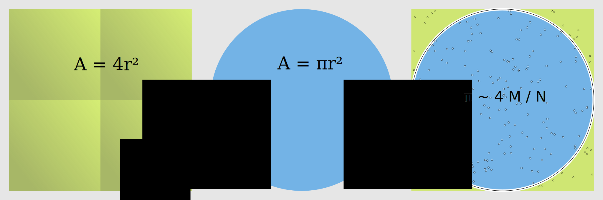

FIXME: Maybe it makes sense to explain the difference between multiprocessing and
multithreading in this chapter?

# Monte Carlo
FIXME: It would be nice to add timing to these examples,
so we can actually see that the vectorized and parallel solutions are faster.

In order to witness the advantages of parallelization we need an algorithm that is 1. parallelizable and 2. complex enough to take a few seconds of CPU time. In order to not scare away the interested reader, we need this algorithm to be understandable and, if possible, interesting. We chose a classical algorithm for demonstrating parallel programming: estimating the value of number π.

The algorithm we are presenting is one of the classical examples of the power of Monte-Carlo methods. This is an umbrella term for several algorithms that use random numbers to approximate exact results. We chose this algorithm because of its simplicity and straightforward geometrical interpretation.

We can compute the value of π using a random number generator. We count the points falling inside
the blue circle M compared to the green square N. Then π is approximated by the ration 4M/N.

> ## Challenge: Implement the algorithm
> Use only standard Python and the function `random.uniform`. The function should have the following
> interface:
> ~~~python
> import random
> def calc_pi(N):
>     """Computes the value of pi using N random samples."""
>     pass
> ~~~
> {: .source}
>
> > ## Solution
> > ~~~python
> > import random
> >
> > def calc_pi(N):
> >     M = 0
> >     for i in range(N):
> >         # Simulate impact coordinates
> >         x = random.uniform(-1, 1)
> >         y = random.uniform(-1, 1)
> >
> >         # True if impact happens inside the circle
> >         if x**2 + y**2 < 1.0:
> >             M += 1
> >     return 4 * M / N
> > ~~~
> > {: .source}
> {: .solution}
{: .challenge}

We now demonstrate a Numpy version of this algorithm.

~~~python
import numpy as np

def calc_pi_numpy(N):
    # Simulate impact coordinates
    pts = np.random.uniform(-1, 1, (2, N))
    # Count number of impacts inside the circle
    M = np.count_nonzero((pts**2).sum(axis=0) < 1)
    return 4 * M / N

calc_pi_numpy(10**8)
~~~
{: .source}

We can demonstrate that this is much faster than the 'naive' implementation. This is a
**vectorized** version of the original algorithm. It nicely demonstrates **data parallelization**,
where a **single operation** is replicated over collections of data.
It contrasts to **task parallelization**, where **different independent** procedures are performed in
parallel (think for example about cutting the vegetables while simmering the split peas).

> ## Discussion: is this all better?
> What is the downside of this implementation?
> - memory use
> - less intuitive
> - monolithic approach, less composable?
{: .discussion}

FIXME: Before this, we actually show the first dask examples in the benchmarking chapter.
It should be explained there that dask.array mimics the numpy API. We could repeat that information
here as a hint to the exercise.
> ## Challenge: Daskify
> Write `calc_pi_dask` to make the Numpy version parallel. Compare speed and memory performance with
> the Numpy version.
>
> > ## Solution
> >
> > ~~~python
> > import dask.array as da
> >
> > def calc_pi_dask(N):
> >     # Simulate impact coordinates
> >     pts = da.random.uniform(-1, 1, (2, N))
> >     # Count number of impacts inside the circle
> >     M = da.count_nonzero((pts**2).sum(axis=0) < 1)
> >     return 4 * M / N
> >
> > calc_pi_numpy(10**8).compute()
> > ~~~
> > {: .source}
> {: .solution}
{: .challenge}

# The GIL
The Global Interpreter Lock is an infamous feature of the Python interpreter. It both guarantees
inner thread sanity, making programming Python safe, and prevents us from using multiple cores from
a single Python instance. There are roughly two classes of solutions to circumvent/lift the GIL:

- Run multiple Python instances: `multiprocessing`
- Have important code outside Python: OS operations, C++ extensions, cython, numba

The downside of running multilple Python instances is that we need to share program state between
different processes. To this end, you need to serialize objects using `pickle`, `json` or similar,
creating a large overhead. The alternative is to bring parts of our code outside Python. Numpy has
many routines that are largely situated outside of the GIL. The only way to know for sure is trying
out and profiling your application.

To write your own routines that do not live under the GIL there are several options: fortunately
`numba` makes this very easy.

# Go Numba
Numba makes it easier to create accellerated functions. You can use it with the decorator `numba.jit`.

~~~python
import numba

@numba.jit
def numba_sum_range(a: int):
    """Compute the sum of the numbers in the range [0, a)."""
    x = 0
    for i in range(a):
        x += i
    return x
~~~

Let's time three versions of the same test. First, native Python iterators:

~~~python
%timeit sum(range(10**7))
~~~
{: .source}

~~~
190 ms ± 3.26 ms per loop (mean ± std. dev. of 7 runs, 10 loops each)
~~~
{: .output}

Now with Numpy:

~~~python
%timeit np.arange(10**7).sum()
~~~
{: .source}

~~~
17.5 ms ± 138 µs per loop (mean ± std. dev. of 7 runs, 100 loops each)
~~~
{: .output}

And with Numba:

~~~python
%timeit numba_sum_range(10**7)
~~~
{: .source}

~~~
162 ns ± 0.885 ns per loop (mean ± std. dev. of 7 runs, 10000000 loops each)
~~~
{: .output}

> ## Challenge: Numbify `comp_pi`
> Create a Numba version of `comp_pi`. Measure its performance.
>
> > ## Solution
> > Add the `@numba.jit` decorator to the first 'naive' implementation.
> {: .solution}
{: .challenge}

# The `threading` module
We now build a queue/worker model. This is the basis of multi-threading applications in Python. At
this point creating a parallel program is quite involved. After we've done this, we'll see ways to
do the same in Dask without mucking about with threads directly.

~~~python
import queue
import threading

### We need to define a worker function that fetches jobs from the queue.
def worker(q):
    while True:
        try:
            x = q.get(block=False)
            print(sum_primes(x), end=' ', flush=True)
        except queue.Empty:
            break

### Create the queue, and fill it with input values
work_queue = queue.Queue()
for i in input_range:
    work_queue.put(i)

### Start a number of threads
threads = [
    threading.Thread(target=worker, args=(work_queue,))
    for i in range(ncpus)]

for t in threads:
    t.start()

### Wait until all of them are done
for t in threads:
    t.join()

print()
~~~

> ## Discussion: where's the speed-up?
> We still need to unlock the GIL
{: .discussion}

> ## Challenge: profile the fixed program
> FIXME: solution
{: .challenge}

