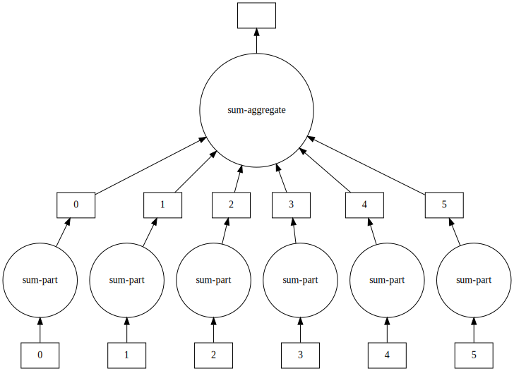

[Dask](https://dask.org/) is one of the many tools available for parallelizing Python code in a comfortable way.
We've seen a basic example of `dask.array` in a previous episode.
Now, we will focus on the `bag` and `delayed` sub-modules.
Dask has a lot of other useful components, such as `dataframe` and `futures`, but we are not going to cover them in this lesson.

See an overview below:

| Dask module      | Abstraction          | Keywords                            | Covered |
|:-----------------|:---------------------|:------------------------------------|:--------|
| `dask.array`     | `numpy`              | Numerical analysis                  | ✔️       |
| `dask.bag`       | `itertools`          | Map-reduce, workflows               | ✔️       |
| `dask.delayed`   | functions            | Anything that doesn't fit the above | ✔️       |
| `dask.dataframe` | `pandas`             | Generic data analysis               | ❌      |
| `dask.futures`   | `concurrent.futures` | Control execution, low-level        | ❌      |

# Parallelize using Dask bags
Dask bags let you compose functionality using several primitive patterns: the most important of these are `map`, `filter`, `fold` and `groupby`.

> ## Discussion
> Open the [Dask documentation on bags](https://docs.dask.org/en/latest/bag-api.html)
> Discuss the `map` and `filter` and `reduction` methods
{: .discussion}

Operations on this level can be distinguished in several categories

- **map** (N to N) applies a function *one-to-one* on a list of arguments. This operation is **embarrassingly
  parallel**.
- **filter** (N to &lt;N) selects a subset from the data.
- **groupby** (N to &lt;N) groups data in subcategories.
- **reduce** (N to 1) computes an aggregate from a sequence of data; if the operation permits it
  (summing, maximizing, etc) this can be done in parallel by reducing chunks of data and then
  further processing the results of those chunks.

~~~python
import dask.bag as db

def f(x):
    return x**2

bag = db.from_sequence(range(6))
bag.map(f).visualize()
~~~
{: .source}

{: .output}

~~~python
def pred(x):
    return x % 2 == 0

bag.filter(pred).compute()
~~~
{: .source}
~~~
[out]: [0, 2, 4]
~~~
{: .output}

~~~python
bag.reduction(sum, sum).visualize()
~~~
{: .source}

{: .output}

> ## Challenge
> Look at the `mean`, `pluck`, `distinct`, and `topk` methods, match them up with `map`, `filter` and
> `reduction` methods.
> > ## Solution
> > `mean` is a reduction, `pluck` is a mapping, and `topk` is a filter. `distinct` could be implemented by getting the length (`count`) after a `groupby`.
> {: .solution}
{: .challenge}

> ## Challenge
> Rewrite the following program in terms of a Dask bag. Make it
> spicy by using your favourite literature classic from project Gutenberg as input.
> Example: Adventures of Sherlock Holmes, https://www.gutenberg.org/files/1661/1661-0.txt
>
> ~~~python
> from nltk.stem.snowball import PorterStemmer
> stemmer = PorterStemmer()
>
> def good_word(w):
>     return len(w) > 0 and not any(i.isdigit() for i in w)
>
> def clean_word(w):
>     return w.strip("*!?.:;'\",“’‘”()_").lower()
> ~~~
> {: .source}
>
> ~~~python
> text = "Lorem ipsum"
> words = set()
> for w in text.split():
>     cw = clean_word(w)
>     if good_word(cw):
>         words.add(stemmer.stem(cw))
> print("This corpus contains {n} unique words.".format(n=len(words)))
> ~~~
> {: .source}
>
> Tip: start by just counting all the words in the corpus, then expand from there.
> Tip: a "better"/different version of this program would be
>
> ~~~python
> words = set(map(stemmer.stem,
>                 filter(good_word,
>                        map(clean_word, text.split()))))
> len(words)
> ~~~
> {: .source}
>
> > ## Solution
> > Use `read_text` to read the text efficiently, split the words and `flatten` to create a
> > single bag, then `map` to capitalize all the words (or find their stems).
> > To split the words, use `group_by` and finaly `count` to reduce to the number of
> > words. Other option `distinct`.
> >
> > ~~~python
> > bag = db.read_text("./1661-0.txt", blocksize="32k")
> > raw_words = bag.str.split().flatten()
> > clean_words = raw_words.map(clean_word).filter(good_word)
> > stems = clean_words.map(stemmer.stem)
> > unique_words = stems.distinct().count()
> > unique_words.compute(scheduler="processes", num_workers=4)
> > ~~~
> > {: .source}
> {: .solution}
{: .challenge}

> ## Challenge: Dask version of Pi estimation
> > ## Solution
> > ~~~python
> > import dask.bag
> > bag = dask.bag.from_sequence(repeat(10**7, 24))
> > shots = bag.map(calc_pi)
> > estimate = shots.mean()
> > estimate.compute()
> > ~~~
> > {: .source}
> {: .solution}
{: .challenge}

> ## Note
> By default Dask runs a bag using multi-processing. This alleviates problems with the GIL, but also means a larger overhead.
{: .callout}

# Dask Delayed
A lot of the functionality in Dask is based on top of a framework of *delayed evaluation*. The concept of delayed evaluation is very important in understanding how Dask functions, which is why we will go a bit deeper into `dask.delayed`.

~~~python
from dask import delayed
~~~
{: .source}

The `delayed` decorator builds a dependency graph from function calls.

~~~python
@delayed
def add(a, b):
    result = a + b
    print(f"{a} + {b} = {result}")
    return a + b
~~~
{: .source}

A `delayed` function stores the requested function call inside a **promise**. Nothing is being done
yet.

~~~python
x_p = add(1, 2)
~~~
{: .source}

We can check that `x_p` is now a `Delayed` value.

~~~python
type(x_p)
~~~
{: .source}
~~~
[out]: dask.delayed.Delayed
~~~
{: .output}

> ## Note
> It is often a good idea to suffix variables that you know are promises with `_p`. That way you
> keep track of promises versus immediate values.
{: .callout}

Only when we evaluate the computation, do we get an output.

~~~python
x_p.compute()
~~~
{:.source}
~~~
1 + 2 = 3
[out]: 3
~~~
{:.output}

From `Delayed` values we can create larger workflows.

~~~python
x_p = add(1, 2)
y_p = add(x_p, 3)
z_p = add(x_p, y_p)
z_p.visualize(rankdir="LR")
~~~
{: .source}

{: .output}

> ## Challenge: run the workflow
> Run the workflow. How many times is `x_p` computed? We needed it twice.
> > ## Solution
> > ~~~python
> > z_p.compute()
> > ~~~
> > {: .source}
> > ~~~
> > 1 + 2 = 3
> > 3 + 3 = 6
> > 3 + 6 = 9
> > [out]: 9
> > ~~~
> > {: .output}
> > The computation of `x_p` (1 + 2) appears only once.
> {: .solution}
{: .challenge}

We can also make a promise by directly calling `delayed`

~~~python
N = 10**7
x_p = delayed(calc_pi)(N)
~~~
{: .source}

It is now possible to call `visualize` or `compute` methods on `x_p`.

We can build new primitives from the ground up.

~~~python
@delayed
def gather(*args):
    return list(args)
~~~
{: .source}

> ## Challenge: understand `gather`
> Can you describe what the `gather` function does in terms of lists and promises? How would you classify `gather` in terms of parallel programming patterns?
> > ## Solution
> > It turns a list of promises into a promise of a list. This computes from many values to a single object and should be considered a *reduction*.
> {: .solution}
{: .challenge}

We can visualize what `gather` does by this small example.

~~~python
x_p = gather(*(add(n, n) for n in range(10)))
x_p.visualize()
~~~
{: .source}

{: .output}

Computing the result,

~~~python
x_p.compute()
~~~
{: .source}
~~~
[out]: [0, 1, 4, 9, 16, 25, 36, 49, 64, 81]
~~~
{: .output}

> ## Challenge: design a `mean` function
> Write a `delayed` function that computes the mean of its arguments. Complete the program to
> compute pi in parallel.
>
> > ## Solution
> > ~~~python
> > @delayed
> > def mean(*args):
> >     return sum(args) / len(args)
> >
> > pi_p = mean(*(delayed(calc_pi)(N) for i in range(10)))
> > pi_p.compute()
> > ~~~
> > {: .source}
> {: .solution}
{: .challenge}

In practice you may not need to use `@delayed` functions too often, but it does offer ultimate
flexibility. You can build complex computational workflows in this manner, sometimes replacing shell
scripting, make files and the likes.


