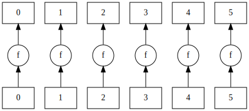

Dask bags let you compose functionality using several primitive patterns: the most important of these are `map`, `filter`, `groupby` and `reduce`.

> ## Discussion
> Open the [Dask documentation on bags](https://docs.dask.org/en/latest/bag-api.html).
> Discuss the `map` and `filter` and `reduction` methods
{: .discussion}

Operations on this level can be distinguished in several categories:

- **map** (N to N) applies a function *one-to-one* on a list of arguments. This operation is **embarrassingly
  parallel**.
- **filter** (N to &lt;N) selects a subset from the data.
- **groupby** (N to &lt;N) groups data in subcategories.
- **reduce** (N to 1) computes an aggregate from a sequence of data; if the operation permits it
  (summing, maximizing, etc) this can be done in parallel by reducing chunks of data and then
  further processing the results of those chunks.

Let's see an example of it in action:

First, let's create the `bag` containing the elements we want to work with (in this case, the numbers from 0 to 5).

~~~python
import dask.bag as db

bag = db.from_sequence(['mary', 'had', 'a', 'little', 'lamb'])
~~~
{: .source}

### Map

To illustrate the concept of `map`, we'll need a mapping function.
In the example below we'll just use a function that squares its argument:

~~~python
# Create a function for mapping
def f(x):
    return x.upper()

# Create the map and compute it
bag.map(f).compute()
~~~
{: .source}
~~~
out: ['MARY', 'HAD', 'A', 'LITTLE', 'LAMB']
~~~
{:.output}

We can also visualize the mapping:

~~~python
# Visualize the map
bag.map(f).visualize()
~~~
{: .source}

{: .output}

### Filter

To illustrate the concept of `filter`, it is useful to have a function that returns a boolean.
In this case, we'll use a function that returns `True` if the argument contains the letter 'a',
and `False` if it doesn't.

~~~python
# Return True if x is even, False if not
def pred(x):
    return 'a' in x

bag.filter(pred).compute()
~~~
{: .source}
~~~
[out]: ['mary', 'had', 'a', 'lamb']
~~~
{: .output}

> ## Difference between `filter` and `map`
> Without executing it, try to forecast what would be the output of `bag.map(pred).compute()`.
> > ## Solution
> > The output will be `[True, True, True, False, True]`.
> {: .solution}
{: .challenge}

### Reduction

~~~python
def count_chars(x):
    per_word = [len(w) for w in x]

    return sum(per_word)

bag.reduction(count_chars, sum).visualize()
~~~
{: .source}

{: .output}

> ## Challenge
> Look at the `mean`, `pluck`, `distinct` methods. These functions could be implemented by using more generic functions that also are in the `dask.bags` library: `map`, `filter`, and `reduce` methods. Can you recognize the design pattern from the descriptions in the documentation?
> > ## Solution
> > `mean` is a reduction, `pluck` is a mapping.
> {: .solution}
{: .challenge}

> ## Challenge
> Rewrite the following program in terms of a Dask bag. Make it
> spicy by using your favourite literature classic from project Gutenberg as input.
> Examples:
> - Mapes Dodge - https://www.gutenberg.org/files/764/764-0.txt
> - Melville - https://www.gutenberg.org/files/15/15-0.txt
> - Conan Doyle - https://www.gutenberg.org/files/1661/1661-0.txt
> - Shelley - https://www.gutenberg.org/files/84/84-0.txt
> - Stoker - https://www.gutenberg.org/files/345/345-0.txt
> - E. Bronte - https://www.gutenberg.org/files/768/768-0.txt
> - Austen - https://www.gutenberg.org/files/1342/1342-0.txt
> - Carroll - https://www.gutenberg.org/files/11/11-0.txt
> - Christie - https://www.gutenberg.org/files/61262/61262-0.txt
>
>
>
> ~~~python
> from nltk.stem.snowball import PorterStemmer
> import requests
> stemmer = PorterStemmer()
>
> def good_word(w):
>     return len(w) > 0 and not any(i.isdigit() for i in w)
>
> def clean_word(w):
>     return w.strip("*!?.:;'\",“’‘”()_").lower()
>
> def load_url(url):
>    response = requests.get(url)
>    return response.text
> ~~~
> {: .source}
>
> ~~~python
> text = "Lorem ipsum"
> words = set()
> for w in text.split():
>     cw = clean_word(w)
>     if good_word(cw):
>         words.add(stemmer.stem(cw))
> print(f"This corpus contains {len(words)} unique words.")
> ~~~
> {: .source}
>
> Tip: start by just counting all the words in the corpus, then expand from there.
> Tip: a "better"/different version of this program would be
>
> ~~~python
> words = set(map(stemmer.stem,
>                 filter(good_word,
>                        map(clean_word, text.split()))))
> len(words)
> ~~~
> {: .source}
>
> All urls in a python list for convenience:
> ```python=
> [
> 'https://www.gutenberg.org/files/764/764-0.txt',
> 'https://www.gutenberg.org/files/15/15-0.txt',
> 'https://www.gutenberg.org/files/1661/1661-0.txt',
> 'https://www.gutenberg.org/files/84/84-0.txt',
> 'https://www.gutenberg.org/files/345/345-0.txt',
> 'https://www.gutenberg.org/files/768/768-0.txt',
> 'https://www.gutenberg.org/files/1342/1342-0.txt',
> 'https://www.gutenberg.org/files/11/11-0.txt',
> 'https://www.gutenberg.org/files/61262/61262-0.txt'
> ]
>```
> > ## Solution
> > Load the list of books as a bag with `db.from_sequence`, load the books by using `map` in
> > combination with the `load_url` function. Split the words and `flatten` to create a
> > single bag, then `map` to capitalize all the words (or find their stems).
> > To split the words, use `group_by` and finaly `count` to reduce to the number of
> > words. Other option `distinct`.
> >
> > ~~~python
> >
> > words = db.from_sequence(books)\
> >          .map(load_url)\
> >          .str.split(' ')\
> >          .flatten().map(clean_word)\
> >          .filter(good_word)\
> >          .map(stemmer.stem)\
> >          .distinct()\
> >          .count()\
> >          .compute()
> >
> > print(f'This collection of books contains {words} unique words')
> > ```
> >
> > ~~~
> > {: .source}
> {: .solution}
{: .challenge}

> ## Challenge: Dask version of Pi estimation
> > ## Solution
> > ~~~python
> > import dask.bag
> > from numpy import repeat
> > import random
> >
> > def calc_pi(N):
> >     """Computes the value of pi using N random samples."""
> >     M = 0
> >     for i in range(N):
> >         # take a sample
> >         x = random.uniform(-1, 1)
> >         y = random.uniform(-1, 1)
> >         if x*x + y*y < 1.: M+=1
> >     return 4 * M / N
> >
> > bag = dask.bag.from_sequence(repeat(10**7, 24))
> > shots = bag.map(calc_pi)
> > estimate = shots.mean()
> > estimate.compute()
> > ~~~
> > {: .source}
> {: .solution}
{: .challenge}

> ## Note
> By default Dask runs a bag using multi-processing. This alleviates problems with the GIL, but also means a larger overhead.
{: .callout}



