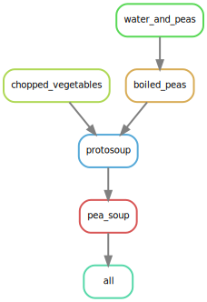

> ## Metalesson!
> This is a metalesson! The instructor should fill in the details.
>
> The material in this demo is currently geared towards an astrophysics application. It is not essential that you understand the specifics of this application. That being said: it is much encouraged to use an example that the instructor is familiar with. The choice of a "real world" example is deliberate: we want participants to feel that this is a real application with real benefits. If you use a different demo, **please consider contributing** it to our repository. Ideally, future instructors can then choose a prepared demo that best suits their taste or background.
{: .callout}

# What are computational workflows?
Imagine you have to process a set of files in order to get some output.
It is likely that you've been there before: most of research involving computers follows this pattern.
Geneticists process gene sequences, mathematical modellers run their models with different
configurations, geologists process batches of satellite images, etc.

Sometimes these workflows are divided in many steps.
From a starting setting, intermediate files are generated.
Afterwards, those intermediate files are further processed, and so on.
They can get pretty complex indeed.

If, like me, you were not born computationally skilled, it is likely that at some point you have
orchestrated such a workflow by hand: generating your files by click, drag and drop.
Checking that everything is there, and then proceeding to the next step.
And so on.

It takes forever.
It is not automated, and thus hardly shareable and reproducible.
And it feels weird, doesn't it?
Like... _there should be a better way to do this!_

And there is, indeed.

In this chapter we'll focus on one solution to this problem: `Snakemake`, a workflow management system.

> ## Why Snakemake?
>
> Because it works nicely, and its syntax is really similar to that of Python.
{: .callout}

> ## What has this to do with parallelization?
>
> As we saw in previous chapters, the key to parallelization is to identify parallelizable tasks.
> In a properly designed workflow, the different branches of the whole process are clearly defined.
> This facilitates greatly the parallelization process, to the point that it becomes _almost_ automatic.
{: .callout}

# Setup
> ## Preparation
> To follow this tutorial, participants need to have cloned the repository at [github.com/escience-academy/parallel-python-workshop](https://github.com/escience-academy/parallel-python-workshop/). This repository includes an `environment.yml` file for creating the proper Conda environment, as well as the Jupyter notebook and `Snakefile` used in this demo.
> This environment includes the [GraphViz](https://graphviz.org/) and [ImageMagick](https://imagemagick.org/) packages needed to do some of the visualizations in this tutorial.
{: .callout}

# Pea soup
Let us return to the recipe for pea soup in the introduction. We specified the recipe in terms of a
set of actions that we needed to perform to get at some result. We could turn this reasoning around
and specify the soup in terms of intermediate goods and end product. This is a method of *declarative
programming* that is in some ways diametrically opossite to our usual way of *imperative
programming*. We state, in a set of rules, what we want, the needed ingredients, and only as a
necessary evil, how we should move from ingredients to product. The order in which we specify these
rules doesn't matter.

## File based
Snakemake tracks dependencies, input and output through the filesystem. Every action should be
reflected as an intermediate file. This may seem as an overhead, but consider that some of the steps
take minutes, days or even weeks to complete. You would want intermediate results to be stored. In
other cases, especially when you're still developing, it is convenient that you get all the
intermediates, so that you can inspect them for correctness.

## Rule `all`
We need to tell `snakemake` what the end product of this workflow is: pea soup! We'd like to eat the
pea soup, so we may consider it a form of *input*. The first rule in a `Snakefile` should always be
the `all` rule (by convention). Some people are confused on why this is specified as an `input`
argument. Just remember that you as a consumer are the one taking the product as an input.

~~~yaml
rule all:
    input:
        "pea-soup.txt"
~~~
{: .source}

The order in which we provide the rules on how to make soup doesn't matter. For simplicity let us
consider the final step: boiling the soup with all its ingredients. This step takes as an input the
*protosoup* as stored in the `protosoup.txt` file.

~~~yaml
rule pea_soup:
    input:
        "protosoup.txt"
    output:
        "pea-soup.txt"
    run:
        boil(input[0], output[0])
~~~
{: .source}

A rule can have multiple input and output files. Let us complete the recipe.

~~~yaml
rule water_and_peas:
    input:
        "peas.txt",
        "water.txt"
    output:
        "water-and-peas.txt"
    run:
        mix(input, output[0])

rule boiled_peas:
    input:
        "water-and-peas.txt"
    output:
        "boiled-peas.txt"
    run:
        boil(input[0], output[0])

rule chopped_vegetables:
    input:
        "vegetables.txt"
    output:
        "chopped-vegetables.txt"
    run:
        chop(input[0], output[0])

rule protosoup:
    input:
        "chopped-vegetables.txt",
        "boiled-peas.txt"
    output:
        "protosoup.txt"
    run:
        mix(input, output[0])
~~~
{: .source}

`water.txt`:
~~~
H₂O H₂O H₂O H₂O H₂O H₂O H₂O H₂O H₂O
H₂O H₂O H₂O H₂O H₂O H₂O H₂O H₂O H₂O
H₂O H₂O H₂O H₂O H₂O H₂O H₂O H₂O H₂O
~~~

`peas.txt`:
~~~
pea pea pea pea pea pea pea pea pea
pea pea pea pea pea pea pea pea pea
pea pea pea pea pea pea pea pea pea
~~~

`vegetables.txt`:
~~~
leek onion potato carrot celeriac
leek onion potato carrot celeriac
leek onion potato carrot celeriac
~~~

Now that we have specified the recipe in terms of intermediate results, and we have all input files
available, we can create a DAG.

~~~bash
snakemake --dag | dot -Tsvg > dag.svg
~~~
{: .source}

{: .output}

## Mixin Python code
To actually run the workflow, we also need to tell Snakemake how to perform the actions. We can
freely intermix Python to achieve this. Paste the following code above the rules in the `Snakefile`.

~~~
import random
from pathlib import Path
import textwrap

def shuffle(x):
    return random.sample(x, k=len(x))

def mix(in_paths: list[Path], out_path: Path) -> None:
    texts = [open(f).read() for f in in_paths]
    words = [w for l in texts for w in l.split()]
    mixed = " ".join(shuffle(words))
    open(out_path, "w").write(textwrap.fill(mixed))

def boil(in_path: Path, out_path: Path) -> None:
    text = open(in_path).read()
    boiled = "".join(shuffle(list(text)))
    open(out_path, "w").write(textwrap.fill(boiled))

def chop(in_path: Path, out_path: Path) -> None:
    text = open(in_path).read()
    chopped = " ".join(list(text))
    open(out_path, "w").write(textwrap.fill(chopped))
~~~
{: .source}

# The metanarrative
The repository contains a Jupyter notebook illustrating a modeling or analysis pipeline. That is, we can demo this notebook and run the analysis for one or a few instances. The analysis takes a few seconds though and now we want to do all this work on a larger dataset.

First we need to **identify the steps**.

We copy-pasted the code from the notebook into a `Snakefile` and put the different steps of the workflow in *rules*.

## Explain
The `Snakefile` is a superset of Python. Everything that is not a Snakemake rule should be valid Python.

### Rules
A rule looks as follows

~~~snakemake
rule <rule name>:
    <rule specs>
~~~
{: .source}

Each rule may specify input and output files and some action that describes how to execute the rule.

### Dependency diagram
Let's go a bit deeper into rule writing by doing a small exercise.

> ## Challenge: create a dependency diagram
> In a new directory create the following `Snakefile`
>
> ~~~python
> rule all:
>     input:
>         "allcaps.txt"
>
> rule generate_message:
>     output:
>         "message.txt"
>     shell:
>         "echo 'Hello, World!' > {output}"
>
> rule shout_message:
>     input:
>         "message.txt"
>     output:
>         "allcaps.txt"
>     shell:
>         "tr [a-z] [A-Z] < {input} > {output}"
> ~~~
> {: .source}
>
> Alternatively, the same can be done using only Python commands:
>
> ~~~python
> rule all:
>     input:
>         "allcaps.txt"
>
> rule generate_message:
>     output:
>         "message.txt"
>     run:
>         with open(output[0], "w") as f:
>             print("Hello, World!", file=f)
>
> rule shout_message:
>     input:
>         "message.txt"
>     output:
>         "allcaps.txt"
>     run:
>         with open(output[0], "w") as f_out, \
>              open(input[0], "r") as f_in:
>             content = f_in.read()
>             f_out.write(content.upper())
> ~~~
> {: .source}
>
> View the dependency diagram: `snakemake --dag | dot | display`, and run the workflow `snakemake -j1`
> What is happening? Create a new rule that concatenates `message.txt` and `allcaps.txt` (use the `cat` command).
> Change the `all` rule to require the new output file. When you rerun the workflow, are all the steps repeated?
>
> > ## Solution
> > ~~~python
> > rule combine:
> >     input: "message.txt", "allcaps.txt"
> >     output: "combined.txt"
> >     shell:
> >         "cat {input} > {output}"
> >         # Windows: "type {input} > {output}" ????
> > ~~~
> >
> > Alternatively, using Python commands:
> >
> > ~~~python
> > rule combine:
> >     input:
> >         "message.txt", "allcaps.txt"
> >     output:
> >         "combined.txt"
> >     run:
> >         with open(output[0], "w") as f_out:
> >             for path in input:
> >                 f_out.write(open(path).read())
> > ~~~
> >
> > Only the `combine` rule is being run (in addition to the `all` rule). The dependency diagram should look like this:
> >
> > 
> > {: .output}
> {: .solution}
{: .challenge}

### Wildcards
An input or output file may contain wildcards. These are names enclosed in braces like `{wildcard}`. A rule with wildcards is the **equivalent of a function** in a normal programming language. We can disect the following rule:

~~~python
rule plot_result:
    input:
        "data/pot0.npy"
    output:
        "data/plot_{timestamp}.png"
    run:
        t = int(wildcards.timestamp) / 1000
        pot = np.load(input[0])
        ... # complicated matplotlib code
        fig.savefig(output[0])
~~~

This rule will match any target file in `data/plot_*.png` where the contents of the wildcard is assigned to `wildcard.timestamp`.

## Action
With this workflow we can do the following:

### Plot the dependency diagram
~~~bash
snakemake --dag | dot | display
~~~

### Run using a single worker
~~~bash
time snakemake -j1
~~~

### Run using multiple workers
~~~bash
time snakemake -j4
~~~

This should run significantly faster than the single worker case.

# Specifics
## Cosmic structure
This workflow is located in the [`cosmic_structure` folder in the `parallel-python-workshop`](https://github.com/escience-academy/parallel-python-workshop/tree/main/cosmic_structure) repository.

It is not the goal of this tutorial to teach cosmic structure formation, that would take us a few weeks. Instead we have a demo using several steps that are typical for any modelling application:

- Setup initial conditions
- Define a range of input parameters
- Generate output for a number of instances in our parameter space
- Combine these outputs into a result

For this tutorial we will be creating a movie (animated gif) from a sequence of results, showing the evolution of the cosmic web over time.

This example computes the formation of structure in the Universe. We use `numpy.random` to generate random densities, emulating the matter density distribution just moments after the big bang. From the densities we use `numpy.fft` to compute a gravitational potential. Clumps of matter tend to attract other surrounding matter in process called *gravitational collapse*. The potential tells us how a particle in this universe would move. From the potential we can compute resulting structures using the `ConvexHull` method in `scipy.spatial`. These result are then visualised using a non-trivial `matplotlib` script. All of these details are hidden inside the `cosmic_structure.py` module.

In the notebook we see how we generate a plot containing three plots for three different times. Now we want to make a movie. We'll use 10 frames.
We use ImageMagick to convert the `.png` output files into an animated `.gif`.
