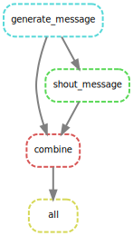

> ## Metalesson!
> This is a metalesson! The instructor should fill in the details.
>
> The material in this demo is currently geared towards an astrophysics application. It is not essential that you understand the specifics of this application. That being said: it is much encouraged to use an example that the instructor is familiar with. The choice of a "real world" example is deliberate: we want participants to feel that this is a real application with real benifits. If you use a different demo, **please consider contributing** it to our repository. Ideally, future instructors can then choose a prepared demo that best suits their taste or background.
{: .callout}

# Setup
> ## Preparation
> To follow this tutorial, participants need to have cloned the repository at [github.com/escience-academy/parallel-python-workshop](https://github.com/escience-academy/parallel-python-workshop/). This repository includes an `environment.yml` file for creating the proper Conda environment, as well as the Jupyter notebook and `Snakefile` used in this demo.
> This environment includes the GraphViz and ImageMagick packages needed to do some of the visualizations in this tutorial.
{: .callout}

# The metanarrative
The repository contains a Jupyter notebook illustrating a modeling or analysis pipeline. That is, we can demo this notebook and run the analysis for one or a few instances. The analysis takes a few seconds though and now we want to do all this work on a larger dataset.

First we need to **identify the steps**.

We copy-pasted the code from the notebook into a `Snakefile` and put the different steps of the workflow in *rules*.

## Explain
The `Snakefile` is a superset of Python. Everything that is not a Snakemake rule should be valid Python.

### Rules
A rule looks as follows

~~~snakemake
rule <rule name>:
    <rule specs>
~~~
{: .source}

Each rule may specify input and output files and some action that describes how to execute the rule.

### Dependency diagram
Let's go a bit deeper into rule writing by doing a small exercise.

> ## Challenge: create a dependency diagram
> In a new directory create the following `Snakefile`
>
> ~~~python
> rule all:
>     input:
>         "allcaps.txt"
>
> rule generate_message:
>     output:
>         "message.txt"
>     shell:
>         "echo 'Hello, World!' > {output}"
>
> rule shout_message:
>     input:
>         "message.txt"
>     output:
>         "allcaps.txt"
>     shell:
>         "tr [a-z] [A-Z] < {input} > {output}"
> ~~~
> {: .source}
>
> View the dependency diagram: `snakemake --dag | dot | display`, and run the workflow `snakemake -j1`
> What is happening? Create a new rule that concatenates `message.txt` and `allcaps.txt` (use the `cat` command).
> Change the `all` rule to require the new output file. When you rerun the workflow, are all the steps repeated?
>
> > ## Solution
> > ~~~python
> > rule combine:
> >     input: "message.txt", "allcaps.txt"
> >     output: "combined.txt"
> >     shell:
> >         "cat {input} > {output}"
> > ~~~
> >
> > Only the `combine` rule is being run (in addition to the `all` rule). The dependency diagram should look like this:
> >
> > 
> > {: .output}
> {: .solution}
{: .challenge}

### Wildcards
An input or output file may contain wildcards. These are names enclosed in braces like `{wildcard}`. A rule with wildcards is the **equivalent of a function** in a normal programming language. We can disect the following rule:

~~~python
rule plot_result:
    input:
        "data/pot0.npy"
    output:
        "data/plot_{timestamp}.png"
    run:
        t = int(wildcards.timestamp) / 1000
        pot = np.load(input[0])
        ... # complicated matplotlib code
        fig.savefig(output[0])
~~~

This rule will match any target file in `data/plot_*.png` where the contents of the wildcard is assigned to `wildcard.timestamp`.

## Action
With this workflow we can do the following:

### Plot the dependency diagram
~~~bash
snakemake --dag | dot | display
~~~

### Run using a single worker
~~~bash
time snakemake -j1
~~~

### Run using multiple workers
~~~bash
time snakemake -j4
~~~

This should run significantly faster than the single worker case.

# Specifics
## Cosmic structure
This workflow is located in the `cosmic_structure` folder in the `parallel-python-workshop` repository.

It is not the goal of this tutorial to teach cosmic structure formation, that would take us a few weeks. Instead we have a demo using several steps that are typical for any modelling application:

- Setup initial conditions
- Define a range of input parameters
- Generate output for a number of instances in our parameter space
- Combine these outputs into a result

For this tutorial we will be creating a movie (animated gif) from a sequence of results, showing the evolution of the cosmic web over time.

This example computes the formation of structure in the Universe. We use `numpy.random` to generate random densities, emulating the matter density distribution just moments after the big bang. From the densities we use `numpy.fft` to compute a gravitational potential. Clumps of matter tend to attract other surrounding matter in process called *gravitational collapse*. The potential tells us how a particle in this universe would move. From the potential we can compute resulting structures using the `ConvexHull` method in `scipy.spatial`. These result are then visualised using a non-trivial `matplotlib` script. All of these details are hidden inside the `cosmic_structure.py` module.

In the notebook we see how we generate a plot containing three plots for three different times. Now we want to make a movie. We'll use 10 frames.
We use ImageMagick to convert the `.png` output files into an animated `.gif`.
