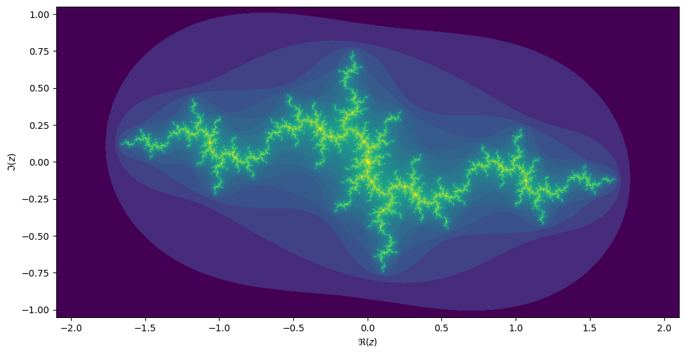

<script type="text/javascript" async
  src="https://cdnjs.cloudflare.com/ajax/libs/mathjax/2.7.5/MathJax.js?config=TeX-MML-AM_CHTML">
</script>

# The Mandelbrot and Julia fractals

This exercise uses Numpy and Matplotlib.

```python
from matplotlib import pyplot as plt
import numpy as np
```

We will be computing the famous [Mandelbrot
fractal](https://en.wikipedia.org/wiki/Mandelbrot_fractal). The Mandelbrot set is the set of complex
numbers $$c \in \mathbb{C}$$ for which the iteration,

$$z_{n+1} = z_n^2 + c,$$

converges, starting iteration at $$z_0 = 0$$. We can visualize the Mandelbrot set by plotting the
number of iterations needed for the absolute value $$|z_n|$$ to exceed 2 (for which it can be shown
that the iteration always diverges).


We may compute the Mandelbrot as follows:

```python
max_iter = 256
width = 256
height = 256
center = -0.8+0.0j
extent = 3.0+3.0j
scale = max((extent / width).real, (extent / height).imag)

result = np.zeros((height, width), int)
for j in range(height):
    for i in range(width):
        c = center + (i - width // 2 + (j - height // 2)*1j) * scale
        z = 0
        for k in range(max_iter):
            z = z**2 + c
            if (z * z.conjugate()).real > 4.0:
                break
        result[j, i] = k
```

Then we can plot with the following code:

```python
fig, ax = plt.subplots(1, 1, figsize=(10, 10))
plot_extent = (width + 1j * height) * scale
z1 = center - plot_extent / 2
z2 = z1 + plot_extent
ax.imshow(result**(1/3), origin='lower', extent=(z1.real, z2.real, z1.imag, z2.imag))
ax.set_xlabel("$\Re(c)$")
ax.set_ylabel("$\Im(c)$")
```

Things become really loads of fun when we start to zoom in. We can play around with the `center` and
`extent` values (and necessarily `max_iter`) to control our window.

```python
max_iter = 1024
center = -1.1195+0.2718j
extent = 0.005+0.005j
```

When we zoom in on the Mandelbrot fractal, we get smaller copies of the larger set!


## Julia sets
For each value $$c$$ we can compute the Julia set, namely the set of starting values $$z_1$$ for
which the iteration over $$z_{n+1}=z_n^2 + c$$ converges. Every location on the Mandelbrot image
corresponds to its own unique Julia set.

```python
max_iter = 256
center = 0.0+0.0j
extent = 4.0+3.0j
scale = max((extent / width).real, (extent / height).imag)

result = np.zeros((height, width), int)
c = -1.1193+0.2718j

for j in range(height):
    for i in range(width):
        z = center + (i - width // 2 + (j - height // 2)*1j) * scale
        for k in range(max_iter):
            z = z**2 + c
            if (z * z.conjugate()).real > 4.0:
                break
        result[j, i] = k
```

If we take the center of the last image, we get the following rendering of the Julia set:



> ## Exercise
> Make this into a parallel program. What kind of speed-ups do you get? Can you get it efficient
> enough so that your code could power an interactive fractal zoomer?
>
> Hint: to structure the code, you may want to create a `GridInfo` class:
>
> ```python
> from dataclasses import dataclass
> from typing import Callable
> import numpy as np
>
> @dataclass
> class GridInfo:
>     width: int
>     height: int
>     center: complex
>     extent: complex
>
>     def map_int(f, *args):
>          """Compute the value of `f(z)` for every point in this
>          grid-info object. You may pass extra arguments to `f` as
>          extra arguments to this function.
>
>          Returns: np.ndarray of size (width, height)"""
>          ...
> ```
>
> Then you may specify the function for computing the Mandelbrot fractal:
>
> ```python
> def iteration_count(f, stop: Callable[(complex,), bool],
>                     start: complex, max_iter: int, *args) -> int:
>     x = start
>     for k in range(max_iter):
>         x = f(x, *args)
>         if stop(x):
>             break
>     return k
>
> def stop_condition(z: complex):
>     return (z.conj() * z).real > 4.0
>
> def mandelbrot(max_iter: int):
>     def mandelbrot_f(c: complex):
>         return iteration_count(lambda z: z**2 + c, stop_condition, 0, max_iter)
>     return mandelbrot_f
> ```
>
> These functions can be JIT compiled with Numba.
{: .challenge}

> ## Optional
> There is another way to compute the Julia fractal: [inverse iteration method
> (IIM)](https://en.wikipedia.org/wiki/Julia_set#Using_backwards_(inverse)_iteration_(IIM)).
> Here you are computing the inverse of $$z_{n} = z_{n-1}^2 + c$$,
>
> $$z_{n-1} = \sqrt{z_n - c}.$$
>
> Because this inverse is multi-valued, your set of points grows exponentially with each inverse
> iteration. This can be solved by randomly selecting a path at each iteration.
{: .challenge}

> ## Optional
> See if you can make your solution work with the following `ipywidgets` code. You may have to
> restructure either your own code or this snippet, whichever you prefer.
>
> You need `ipympl` installed, for this to work.
>
> ```shell
> conda install -c conda-forge ipympl
> conda install -c conda-forge nodejs
> jupyter labextension install @jupyter-widgets/jupyterlab-manager jupyter-matplotlib
> # restart Jupyter
> ```
>
> ```python
> %matplotlib widget
> import ipywidgets as widgets
>
> fig, ax = plt.subplots(1, 2, figsize=(10, 5))
>
> # Plot the Mandelbrot to ax[0]; for this to work you need
> # a function `plot_fractal` that plots the fractal for you,
> # and a precomputed mandelbrot in `mandelbrot_im`.
> mandel_grid = GridInfo(256, 256, -0.8+0.0j, 3.0+2.0j)
> mandelbrot_im = mandel_grid.int_map(mandelbrot(256))
> plot_fractal(mandel_grid, np.log(mandelbrot_im+1), ax=ax[0])
>
> # Add a marker for the selector location
> mbloc = ax[0].plot(0, 0, 'r+')
>
> # This function only updates the position of the marker
> def update_mandel_plot(c):
>     mbloc[0].set_xdata(c.real)
>     mbloc[0].set_ydata(c.imag)
>     fig.canvas.draw()
>
> # `julia_ic` should return a Numba optimized function that
> # iterates `z = z^2 + c` for a `c` that is given as an extra
> # parameter.
> julia_fun = julia(256)
> julia_grid = GridInfo(256, 256, 0.0+0.0j, 3+3j)
> julia_im = julia_grid.int_map(julia_fun, 0)
> plot_fractal(julia_grid, np.log(julia_im + 1), ax=ax[1])
>
> def update_julia_plot(c):
>     julia_im = julia_grid.int_map(julia_it, c)
>     plot_fractal(julia_grid, np.log(julia_im + 1), ax=ax[1])
>
> @widgets.interact(x=(-2, 1.0, 0.01), y=(-1.5, 1.5, 0.01))
> def update(x, y):
>     c = x + 1j * y
>     update_mandel_plot(c)
>     update_julia_plot(c)
>
> plt.tight_layout()
> ```
{: .challenge}

