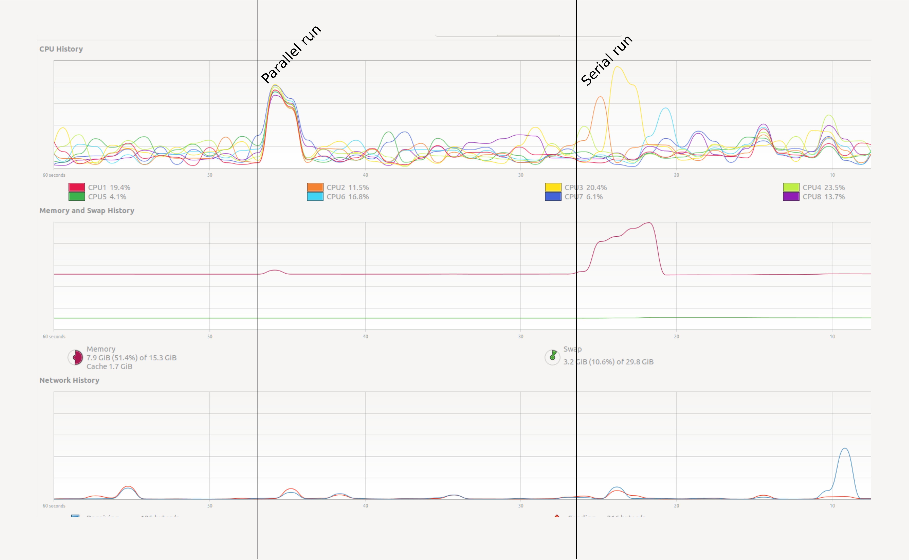

:::questions
- How do we know whether our program ran faster in parallel?
- How do we appraise efficiency?
:::

:::objectives
- View performance on system monitor.
- Find out how many cores your machine has.
- Use `%time` and `%timeit` line-magic.
- Use a memory profiler.
- Plot performance against number of work units.
- Understand the influence of hyper-threading on timings.
:::


# A first example with Dask
We will create parallel programs in Python later. First let's see a small example. Open
your System Monitor (the application will vary between specific operating systems), and run the following code examples:

```python
# Summation making use of numpy:
import numpy as np
result = np.arange(10**7).sum()
```

```python
# The same summation, but using dask to parallelize the code.
# NB: the API for dask arrays mimics that of numpy
import dask.array as da
work = da.arange(10**7).sum()
result = work.compute()
```

:::callout
## Try a heavy enough task
Your system monitor may not detect so small a task. In your computer you may have to gradually raise the problem size to ``10**8`` or ``10**9`` to observe the effect in long enough a run. But be careful and increase slowly! Asking for too much memory can make your computer slow to a crawl.
:::

{alt="screenshot of system monitor"}

How can we monitor this more conveniently? In Jupyter we can use some line magics, small "magic words" preceded
by the symbol `%%` that modify the behaviour of the cell.

```python
%%time
np.arange(10**7).sum()
```

The `%%time` line magic checks how long it took for a computation to finish. It does not affect how the computation is performed. In this regard it is very similar to the `time` shell command.

If we run the chunk several times, we will notice variability in the reported times.
How can we trust this timer, then?
A possible solution will be to time the chunk several times, and take the average time as our valid measure.
The `%%timeit` line magic does exactly this in a concise and convenient manner!
`%%timeit` first measures how long it takes to run a command once, then
repeats it enough times to get an average run-time. Also, `%%timeit` can measure run times discounting the overhead of setting up a problem and measuring only the performance of the code in the cell.
So this outcome is more trustworthy.

```python
%%timeit
np.arange(10**7).sum()
```

You can store the output of `%%timeit` in a Python variable using the `-o` flag:

```python
time = %timeit -o np.arange(10**7).sum()
print(f"Time taken: {time.average:.4f} s")
```

Note that this metric does not tell you anything about memory consumption or efficiency.

:::challenge
## Timeit
Use `timeit` to time the following snippets:

```python
[x**2 for x in range(100)]
```

```python
map(lambda x: x**2, range(100))
```

Can you explain the difference? How about the following

```python
for x in range(100):
    x**2
```

Is that faster than the first one? Why?

::::solution
Python's `map` function is lazy. It won't compute anything until you iterate it. Try `list(map(...))`. The third example doesn't allocate any memory, which makes it faster.
::::
:::

# Memory profiling
- **Benchmarking** is the action of systematically testing performance under different conditions.
- **Profiling** is the analysis of which parts of a program contribute to the total performance, and the identification of possible bottlenecks.

We will use the package [`memory_profiler`](https://github.com/pythonprofilers/memory_profiler) to track memory usage.
It can be installed executing the code below in the console:

~~~sh
pip install memory_profiler
~~~

The memory usage of the serial and parallel versions of a code will vary. In Jupyter, type the following lines to see the effect in the code presented above (again, increase the baseline value `10**7` if needed):

```python
import numpy as np
import dask.array as da
from memory_profiler import memory_usage
import matplotlib.pyplot as plt

def sum_with_numpy():
    # Serial implementation
    np.arange(10**7).sum()

def sum_with_dask():
    # Parallel implementation
    work = da.arange(10**7).sum()
    work.compute()

memory_numpy = memory_usage(sum_with_numpy, interval=0.01)
memory_dask = memory_usage(sum_with_dask, interval=0.01)

# Plot results
plt.plot(memory_numpy, label='numpy')
plt.plot(memory_dask, label='dask')
plt.xlabel('Interval counter [-]')
plt.ylabel('Memory usage [MiB]')
plt.legend()
plt.show()
```

The plot should be similar to the one below:

{alt="showing very high peak for numpy, and constant low line for dask"}

:::challenge
## Exercise (plenary)
Why is the Dask solution more memory-efficient?

::::solution
## Solution
Chunking! Dask chunks the large array so that the data is never entirely in memory.
::::
:::

:::callout
## Profiling from Dask
Dask has several built-in option for profiling. See the [dask documentation](https://docs.dask.org/en/latest/diagnostics-local.html) for more information.
:::

# Using many cores
Using more cores for a computation can decrease the run time. The first question is of course: how many cores do I have? See the snippet below to find this out:

:::callout
## Find out the number of cores in your machine
The number of cores can be found from Python upon executing:

```python
import psutil
N_physical_cores = psutil.cpu_count(logical=False)
N_logical_cores = psutil.cpu_count(logical=True)
print(f"The number of physical/logical cores is {N_physical_cores}/{N_logical_cores}")
```
:::

Usually the number of logical cores is higher than the number of physical cores. This is due to *hyper-threading*,
which enables each physical CPU core to execute several threads at the same time. Even with simple examples,
performance may scale unexpectedly. There are many reasons for this, hyper-threading being one of them.
See the ensuing example.

On a machine with 4 physical and 8 logical cores, this admittedly over-simplistic benchmark:

```python
x = []
for n in range(1, 9):
    time_taken = %timeit -r 1 -o da.arange(5*10**7).sum().compute(num_workers=n)
    x.append(time_taken.average)
```

gives the result:

```python
import pandas as pd
data = pd.DataFrame({"n": range(1, 9), "t": x})
data.set_index("n").plot()
```

{alt="showing that using more cores can also make things slower"}

:::discussion
## Discussion
Why does the runtime increase if we add more than 4 cores? This has to do with **hyper-threading**. On most architectures it does not make much sense to use more workers than the physical cores you have.
:::

:::keypoints
- Understanding performance is often non-trivial.
- Memory is just as important as speed.
- To measure is to know.
:::


