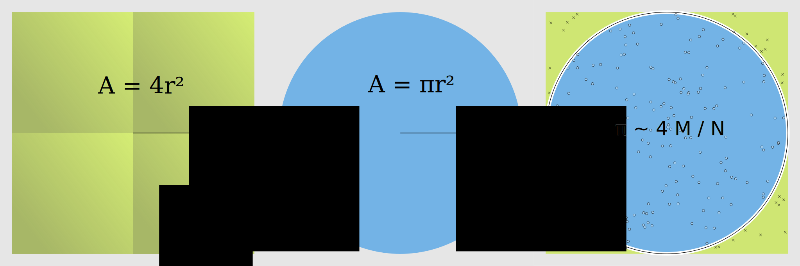

:::questions
- How do I parallelize a Python application?
- What is data parallelism?
- What is task parallelism?
:::

:::objectives
- Rewrite a program in a vectorized form.
- Understand the difference between data-based and task-based parallel programming.
- Apply `numba.jit` to accelerate Python.
:::

# Parallelizing a Python application
In order to recognize the advantages of parallelism we need an algorithm that is easy to parallelize, complex enough to take a few seconds of CPU time, understandable, and also interesting not to scare away the interested learner.
Estimating the value of number $\pi$ is a classical problem to demonstrate parallel programming.

The algorithm we present is a classical demonstration of the power of Monte Carlo methods.
This is a category of algorithms using random numbers to approximate exact results.
This approach is simple and has a straightforward geometrical interpretation.

We can compute the value of $\pi$ using a random number generator. We count the points falling inside the blue circle M compared to the green square N.
The ratio 4M/N then approximates $\pi$.

{alt="the area of a unit sphere contains a multiple of pi"}

:::challenge
## Challenge: Implement the algorithm
Use only standard Python and the method `random.uniform`. The function should have the following
interface:

```python
import random
def calc_pi(N):
    """Computes the value of pi using N random samples."""
    ...
    for i in range(N):
        # take a sample
        ...
    return ...
```

Also, make sure to time your function!

::::solution
## Solution

```python
import random

def calc_pi(N):
    M = 0
    for i in range(N):
        # Simulate impact coordinates
        x = random.uniform(-1, 1)
        y = random.uniform(-1, 1)

        # True if impact happens inside the circle
        if x**2 + y**2 < 1.0:
            M += 1
    return 4 * M / N

%timeit calc_pi(10**6)
```

```output
676 ms ± 6.39 ms per loop (mean ± std. dev. of 7 runs, 1 loop each)
```
::::
:::

Before we parallelize this program, the inner function must be as
efficient as we can make it. We show two techniques for doing this: *vectorization* using `numpy`, and
*native code generation* using `numba`.

We first demonstrate a Numpy version of this algorithm:

```python
import numpy as np

def calc_pi_numpy(N):
    # Simulate impact coordinates
    pts = np.random.uniform(-1, 1, (2, N))
    # Count number of impacts inside the circle
    M = np.count_nonzero((pts**2).sum(axis=0) < 1)
    return 4 * M / N
```

This is a **vectorized** version of the original algorithm. A problem written in a vectorized form becomes amenable to **data parallelization**, where each single operation is replicated over a large collection of data. Data parallelism contrasts with **task parallelism**, where different independent procedures are performed in parallel. An example of task parallelism is the pea-soup recipe in the introduction.

This implementation is much faster than the 'naive' implementation above: 

```python
%timeit calc_pi_numpy(10**6)
```

```output
25.2 ms ± 1.54 ms per loop (mean ± std. dev. of 7 runs, 10 loops each)
```

:::discussion
## Discussion: is this all better?
What is the downside of the vectorized implementation?
- It uses more memory.
- It is less intuitive.
- It is a more monolithic approach, i.e., you cannot break it up in several parts.
:::

:::challenge
## Challenge: Daskify
Write `calc_pi_dask` to make the Numpy version parallel. Compare its speed and memory performance with
the Numpy version. NB: Remember that the API of `dask.array` mimics that of the Numpy.

::::solution
## Solution

```python
import dask.array as da

def calc_pi_dask(N):
    # Simulate impact coordinates
    pts = da.random.uniform(-1, 1, (2, N))
    # Count number of impacts inside the circle
    M = da.count_nonzero((pts**2).sum(axis=0) < 1)
    return 4 * M / N

%timeit calc_pi_dask(10**6).compute()
```

```output
4.68 ms ± 135 µs per loop (mean ± std. dev. of 7 runs, 100 loops each)
```
::::
:::

# Using Numba to accelerate Python code
Numba makes it easier to create accelerated functions. You can activate it with the decorator `numba.jit`.

```python
import numba

@numba.jit
def sum_range_numba(a):
    """Compute the sum of the numbers in the range [0, a)."""
    x = 0
    for i in range(a):
        x += i
    return x
```

Let's time three versions of the same test. First, native Python iterators:

```python
%timeit sum(range(10**7))
```

```output
190 ms ± 3.26 ms per loop (mean ± std. dev. of 7 runs, 10 loops each)
```

Second, with Numpy:

```python
%timeit np.arange(10**7).sum()
```

```output
17.5 ms ± 138 µs per loop (mean ± std. dev. of 7 runs, 100 loops each)
```

Third, with Numba:

```python
%timeit sum_range_numba(10**7)
```

```output
162 ns ± 0.885 ns per loop (mean ± std. dev. of 7 runs, 10000000 loops each)
```

Numba is hundredfold faster in this case! It gets this speedup with "just-in-time" compilation (JIT) — that is, compiling the Python
function into machine code just before it is called, as the `@numba.jit` decorator indicates.
Numba does not support every Python and Numpy feature, but functions written with a for-loop with a large number of iterates, like in our `sum_range_numba()`, are good candidates.

:::callout
## Just-in-time compilation speedup

The first time you call a function decorated with `@numba.jit`, you may see no or little speedup. The function can then be much faster in subsequent calls. Also, `timeit` may throw this warning:

`The slowest run took 14.83 times longer than the fastest. This could mean that an intermediate result is being cached.`

Why does this happen?
On the first call, the JIT compiler needs to compile the function. On subsequent calls, it reuses the
function previously compiled. The compiled function can *only* be reused if the types of its arguments (int, float, and the like) are the same as at the point of compilation.

See this example, where `sum_range_numba` is timed once again with a float argument instead of an int:
```python
%time sum_range_numba(10**7)
%time sum_range_numba(10.**7)
```
```output
CPU times: user 58.3 ms, sys: 3.27 ms, total: 61.6 ms
Wall time: 60.9 ms
CPU times: user 5 µs, sys: 0 ns, total: 5 µs
Wall time: 7.87 µs
```
:::

:::challenge
## Challenge: Numbify `calc_pi`
Create a Numba version of `calc_pi`. Time it.

::::solution
## Solution
Add the `@numba.jit` decorator to the first 'naive' implementation.
```python
@numba.jit
def calc_pi_numba(N):
    M = 0
    for i in range(N):
        # Simulate impact coordinates
        x = random.uniform(-1, 1)
        y = random.uniform(-1, 1)

        # True if impact happens inside the circle
        if x**2 + y**2 < 1.0:
            M += 1
    return 4 * M / N

%timeit calc_pi_numba(10**6)
```
```output
13.5 ms ± 634 µs per loop (mean ± std. dev. of 7 runs, 1 loop each)
```
::::
:::

:::callout
## Measuring = knowing
Always profile your code to see which parallelization method works best.
:::

:::callout
## `numba.jit` is not a magical command to solve your problems
Accelerating your code with Numba often outperforms other methods, but rewriting code to reap the benefits of Numba is not always trivial.
:::

:::keypoints
- Always profile your code to see which parallelization method works best.
- Vectorized algorithms are both a blessing and a curse.
- Numba can help you speed up code.
:::
