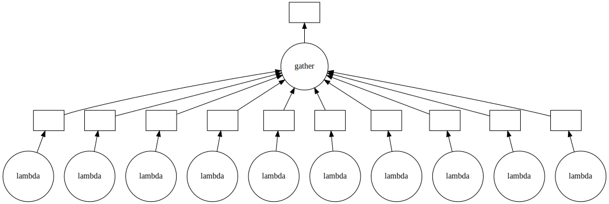

:::questions
- What abstractions does Dask offer?
- How can I paralellize existing Python code?
:::

:::objectives
- Understand the abstraction of delayed evaluation.
- Use the `visualize` method to create dependency graphs.
:::


[Dask](https://dask.org/) is one of many convenient tools available for parallelizing Python code. We have seen a basic example of `dask.array` in a previous episode. Now, we will focus on the `delayed` and `bag` sub-modules. Dask has other useful components that we do not cover in this lesson, such as `dataframe` and `futures`.

See an overview below:

| Dask module      | Abstraction          | Keywords                            | Covered |
|:-----------------|:---------------------|:------------------------------------|:--------|
| `dask.array`     | `numpy`              | Numerical analysis                  | ✔️       |
| `dask.bag`       | `itertools`          | Map-reduce, workflows               | ✔️       |
| `dask.delayed`   | functions            | Anything that doesn't fit the above | ✔️       |
| `dask.dataframe` | `pandas`             | Generic data analysis               | ❌      |
| `dask.futures`   | `concurrent.futures` | Control execution, low-level        | ❌      |

# Dask Delayed
A lot of the functionalities in Dask are based on an important concept known as *delayed evaluation*. Hence we go a bit deeper into `dask.delayed`.

`dask.delayed` changes the strategy by which our computation is evaluated. Normally, you expect that a computer runs commands when you ask for them, and that you can give the next command when the current job is complete. With delayed evaluation we do not wait before formulating the next command. Instead, we create the dependency graph of our complete computation without actually doing any work. Once we build the full dependency graph, we can see which jobs can be done in parallel and have those scheduled to different workers.

To express a computation in this world, we need to handle future objects *as if they're already there*. These objects may be referred to as either *futures* or *promises*. 

:::callout
Several Python libraries provide slightly different support for working with futures. The main difference between Python futures and Dask-delayed objects is that futures are added to a queue at the point of definition, while delayed objects are silent until you ask to compute. We will refer to such 'live' futures as futures proper, and to 'dead' futures (including the delayed) as **promises**.
:::

~~~python
from dask import delayed
~~~

The `delayed` decorator builds a dependency graph from function calls:

~~~python
@delayed
def add(a, b):
    result = a + b
    print(f"{a} + {b} = {result}")
    return result
~~~

A `delayed` function stores the requested function call inside a **promise**. The function is not actually executed yet, and we get a value *promised*, which can be computed later.

~~~python
x_p = add(1, 2)
~~~

We can check that `x_p` is now a `Delayed` value:

~~~python
type(x_p)
~~~
~~~output
[out]: dask.delayed.Delayed
~~~

> ## Note on notation
> It is good practice to suffix with `_p` variables that are promises. That way you
> keep track of promises versus immediate values.
{: .callout}

Only when we ask to evaluate the computation do we get an output:

~~~python
x_p.compute()
~~~
~~~output
1 + 2 = 3
[out]: 3
~~~

From `Delayed` values we can create larger workflows and visualize them:

~~~python
x_p = add(1, 2)
y_p = add(x_p, 3)
z_p = add(x_p, y_p)
z_p.visualize(rankdir="LR")
~~~

{.output alt="boxes and arrows"}

:::challenge
## Challenge: run the workflow
Given this workflow:

```python
x_p = add(1, 2)
y_p = add(x_p, 3)
z_p = add(x_p, -3)
```

Visualize and compute `y_p` and `z_p` separately. How many times is `x_p` evaluated?

Now change the workflow:

```python
x_p = add(1, 2)
y_p = add(x_p, 3)
z_p = add(x_p, y_p)
z_p.visualize(rankdir="LR")
```

We pass the not-yet-computed promise `x_p` to both `y_p` and `z_p`. If you only compute `z_p`, how many times do you expect `x_p` to be evaluated? Run the workflow to check your answer.

::::solution
## Solution
```python
z_p.compute()
```
```output
1 + 2 = 3
3 + 3 = 6
3 + 6 = 9
[out]: 9
```
The computation of `x_p` (1 + 2) appears only once. This should convince you to procrastinate the call `compute` as long as you can.
::::
:::

We can also make a promise by directly calling `delayed`:

~~~python
N = 10**7
x_p = delayed(calc_pi)(N)
~~~

It is now possible to call `visualize` or `compute` methods on `x_p`.

:::callout
## Decorators
In Python the decorator syntax is equivalent to passing a function through a function adapter, also known as a higher order function or a functional. This adapter can change the behaviour of the function in many ways. The statement

```python
@delayed
def sqr(x):
    return x*x
```

is functionally equivalent to:

```python
def sqr(x):
    return x*x

sqr = delayed(sqr)
```
:::

:::callout
## Variadic arguments
In Python you can define functions taking arbitrary number of arguments:

```python
def add(*args):
 return sum(args)

add(1, 2, 3, 4)   # => 10
```

You can then use tuple-unpacking to pass a sequence of arguments:

```python
numbers = [1, 2, 3, 4]
add(*numbers)   # => 10
```
:::

We can build new primitives from the ground up. An important function that is found frequently where non-standard evaluation strategies are involved is `gather`. We can implement `gather` as follows:

~~~python
@delayed
def gather(*args):
    return list(args)
~~~

:::challenge
## Challenge: understand `gather`
Can you describe what the `gather` function does in terms of lists and promises?
Hint: Suppose I have a list of promises, what does `gather` enable me to do?

::::solution
## Solution
It turns a list of promises into a promise of a list.
:::
::::

This small example shows what `gather` does:

~~~python
x_p = gather(*(delayed(add)(n, n) for n in range(10))) # Shorthand for gather(add(1, 1), add(2, 2), ...)
x_p.visualize()
~~~


{.output alt="boxes and arrows"}

Computing the result

~~~python
x_p.compute()
~~~

gives

~~~output
[out]: [0, 1, 4, 9, 16, 25, 36, 49, 64, 81]
~~~

:::challenge
## Challenge: design a `mean` function and calculate $\pi$
Write a `delayed` function that computes the mean of its arguments. Use it to estimate $\pi$ several times and have it return the mean of the intermediate results.

```python
>>> mean(1, 2, 3, 4).compute()
2.5
```

Make sure that the entire computation is contained in a single promise.

::::solution
## Solution
~~~python
from dask import delayed
import random

@delayed
def mean(*args):
    return sum(args) / len(args)

def calc_pi(N):
    """Computes the value of pi using N random samples."""
    M = 0
    for i in range(N):
        # take a sample
        x = random.uniform(-1, 1)
        y = random.uniform(-1, 1)
        if x*x + y*y < 1.: M+=1
    return 4 * M / N


N = 10**6
pi_p = mean(*(delayed(calc_pi)(N) for i in range(10)))
pi_p.compute()
~~~
::::
:::

You may not see a significant speed-up. This is because `dask delayed` uses threads by default, and our native Python implementation of `calc_pi` does not circumvent the GIL. You should see a more significant speed-up with the Numba version of `calc_pi`, for example.  

In practice, you may not need to use `@delayed` functions frequently, but they do offer ultimate flexibility. You can build complex computational workflows in this manner, sometimes replacing shell scripting, make files, and suchlike.

:::keypoints
- We can change the strategy by which a computation is evaluated.
- Nothing is computed until we run `compute()`.
- With delayed evaluation Dask knows which jobs can be run in parallel.
- Call `compute` only once at the end of your program to get the best results.
:::
