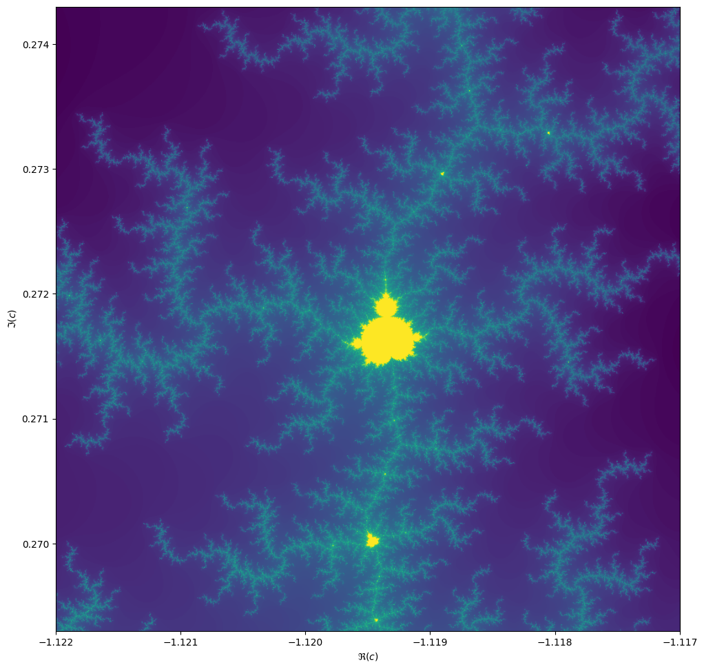

:::questions
- Can we try a real problem now?
:::

:::objectives
- Create a strategy to parallelise existing code
- Apply previous lessons
:::

# The Mandelbrot and Julia fractals

This exercise uses Numpy and Matplotlib.

```python
from matplotlib import pyplot as plt
import numpy as np
```

We will be computing the famous [Mandelbrot
fractal](https://en.wikipedia.org/wiki/Mandelbrot_fractal).

:::callout
## Complex numbers
Complex numbers are a special representation of rotations and scalings in the two-dimensional plane. Multiplying two complex numbers is the same as taking a point, rotate it by an angle $\phi$ and scale it by the absolute value. Multiplying with a number $z \in \mathbb{C}$ by 1 preserves $z$. Multiplying a point at $i = (0, 1)$ (having a positive angle of 90 degrees and absolute value 1), rotates it anti-clockwise by 90 degrees. Then you might see that $i^2 = (-1, 0)$. The funny thing is, that we can treat $i$ as any ordinary number, and all our algebra still works out. This is actually nothing short of a miracle! We can write a complex number 

$$z = x + iy,$$

remember that $i^2 = -1$ and act as if everything is normal!
:::

The Mandelbrot set is the set of complex numbers $$c \in \mathbb{C}$$ for which the iteration,

$$z_{n+1} = z_n^2 + c,$$

converges, starting iteration at $z_0 = 0$. We can visualize the Mandelbrot set by plotting the
number of iterations needed for the absolute value $|z_n|$ to exceed 2 (for which it can be shown
that the iteration always diverges).

{alt="colorful rendering of mandelbrot set"}

We may compute the Mandelbrot as follows:

```python
max_iter = 256
width = 256
height = 256
center = -0.8+0.0j
extent = 3.0+3.0j
scale = max((extent / width).real, (extent / height).imag)

result = np.zeros((height, width), int)
for j in range(height):
    for i in range(width):
        c = center + (i - width // 2 + (j - height // 2)*1j) * scale
        z = 0
        for k in range(max_iter):
            z = z**2 + c
            if (z * z.conjugate()).real > 4.0:
                break
        result[j, i] = k
```

Then we can plot with the following code:

```python
fig, ax = plt.subplots(1, 1, figsize=(10, 10))
plot_extent = (width + 1j * height) * scale
z1 = center - plot_extent / 2
z2 = z1 + plot_extent
ax.imshow(result**(1/3), origin='lower', extent=(z1.real, z2.real, z1.imag, z2.imag))
ax.set_xlabel("$\Re(c)$")
ax.set_ylabel("$\Im(c)$")
```

Things become really loads of fun when we start to zoom in. We can play around with the `center` and
`extent` values (and necessarily `max_iter`) to control our window.

```python
max_iter = 1024
center = -1.1195+0.2718j
extent = 0.005+0.005j
```

When we zoom in on the Mandelbrot fractal, we get smaller copies of the larger set!



:::challenge
## Exercise
Make this into an efficient parallel program. What kind of speed-ups do you get? 

::::solution
### Create a `BoundingBox` class
We start with a naive implementation. It may be convenient to define a `BoundingBox` class in a separate module `bounding_box.py`. We'll add methods to this class later on.

``` {.python file="src/mandelbrot/bounding_box.py"}
from dataclasses import dataclass
from typing import Optional
import numpy as np


@dataclass
class BoundingBox:
    width: int
    height: int
    center: complex
    extent: complex
    _scale: Optional[float] = None

    @property
    def scale(self):
        if self._scale is None:
            self._scale = max(self.extent.real / self.width,
                              self.extent.imag / self.height)
        return self._scale

    <<bounding-box-methods>>

test_case = BoundingBox(1024, 1024, -1.1195+0.2718j, 0.005+0.005j)
```
::::

::::solution
## Plotting function

``` {.python file="src/mandelbrot/plotting.py"}
import matplotlib  # type:ignore
matplotlib.use(backend="Agg")
from matplotlib import pyplot as plt
import numpy as np

from .bounding_box import BoundingBox

def plot_fractal(box: BoundingBox, values: np.ndarray, ax=None):
    if ax is None:
        fig, ax = plt.subplots(1, 1, figsize=(10, 10))
    else:
        fig = None
    plot_extent = (box.width + 1j * box.height) * box.scale
    z1 = box.center - plot_extent / 2
    z2 = z1 + plot_extent
    ax.imshow(values, origin='lower', extent=(z1.real, z2.real, z1.imag, z2.imag),
              cmap=matplotlib.colormaps["jet"])
    ax.set_xlabel("$\Re(c)$")
    ax.set_ylabel("$\Im(c)$")
    return fig, ax
```
::::

::::solution
## Some solutions
The main approach with Python will be: use Numba to make this fast. Then there are two ways to parallelize: let Numba parallelize the function, or do a manual domain decomposition and use one of many ways in Python to run things multi-threaded. There is a third way: create a vectorized function and parallelize using `dask.array`. This last option is almost always slower than `@njit(parallel=True)` or domain decomposition.

``` {.python file="src/mandelbrot/__init__.py"}

```

### Numba
Create a file `mandelbrot_numba.py`. We have to pass all parameters as primitive objects, otherwise Numba can't compile with `nopython`.

``` {.python file="src/mandelbrot/numba.py"}
from typing import Optional, Union
import numba  # type:ignore
from numba import prange  # type:ignore
import numpy as np
from numba_progress import ProgressBar  # type:ignore

from .bounding_box import BoundingBox, test_case
from .plotting import plot_fractal

@numba.njit(nogil=True, parallel=True)
def compute_mandelbrot(width: int, height: int, center: complex, scale: complex, max_iter:int, progress):
    result = np.zeros((height, width), np.int64)
    for j in prange(height):
        for i in prange(width):
            c = center + (i - width // 2 + (j - height // 2) * 1j) * scale
            z = 0.0+0.0j
            for k in range(max_iter):
                z = z**2 + c
                if (z*z.conjugate()).real >= 4.0:
                    break
            result[j, i] = k
        progress.update(width)
    return result


if __name__ == "__main__":
    with ProgressBar(total=1, desc="compiling") as progress:
        compute_mandelbrot(1, 1, 0, 1+1j, 1, progress)

    box = test_case
    max_iter = 1024

    with ProgressBar(desc="computing", total=box.width*box.height) as progress:
        result = compute_mandelbrot(
            box.width, box.height, box.center, box.scale,
            max_iter=max_iter, progress=progress)
    fig, _ = plot_fractal(box, np.log(result + 1))
    fig.savefig("numba-output.png", bbox_inches="tight")
```

### Domain splitting
We split the computation into a set of sub-domains. The `BoundingBox.split()` method is designed such that if we deep-map the resulting list-of-lists, we can recombine the results using `numpy.block()`.

``` {.python #bounding-box-methods}
def split(self, n):
    """Split the domain in nxn subdomains, and return a grid of BoundingBoxes."""
    w = self.width // n
    h = self.height // n
    e = self.scale * w + self.scale * h * 1j
    x0 = self.center - e * (n / 2 - 0.5)
    return [[BoundingBox(w, h, x0 + i * e.real + j * e.imag * 1j, e)
             for i in range(n)]
            for j in range(n)]
```

To perform the computation in parallel, lets go ahead and chose the most difficult path: `asyncio`. There are other ways to do this, setting up a number of threads, or use Dask. However, `asyncio` is available to us in Python natively. In the end, the result is very similar to what we would get using `dask.delayed`.

This may seem as a lot of code, but remember: we only used Numba to compile the core part and then used Asyncio to parallelize. The progress bar is a bit of flutter and the semaphore is only there to throttle the computation to fewer cores.

``` {.python file="src/mandelbrot/domain_splitting.py"}
import numba  # type:ignore
import numpy as np
from typing import Optional   # , AsyncContextManager
import asyncio
from psutil import cpu_count  # type:ignore
from contextlib import nullcontext

from numba_progress import ProgressBar  # type:ignore

from .bounding_box import BoundingBox, test_case
from .plotting import plot_fractal


@numba.njit(nogil=True)
def compute_mandelbrot_numba(result, width: int, height: int, center: complex,
                             scale: complex, max_iter: int, progress):
    for j in range(height):
        for i in range(width):
            c = center + (i - width // 2 + (j - height // 2) * 1j) * scale
            z = 0.0+0.0j
            for k in range(max_iter):
                z = z**2 + c
                if (z*z.conjugate()).real >= 4.0:
                    break
            result[j, i] = k
        progress.update(width)
    return result


async def compute_mandelbrot(
        box: BoundingBox,
        max_iter: int,
        progress: ProgressBar,
        semaphore: Optional[asyncio.Semaphore]):
    result = np.zeros((box.height, box.width), np.int64)
    async with semaphore or nullcontext():
        await asyncio.to_thread(
            compute_mandelbrot_numba,
            result, box.width, box.height, box.center, box.scale,
            max_iter=max_iter, progress=progress)
    return result


async def main(throttle: Optional[int] = None):
    sem = asyncio.Semaphore(throttle) if throttle is not None else None
    n_cpus = cpu_count(logical=True)

    with ProgressBar(total=1, desc="compiling") as progress:
        await compute_mandelbrot(BoundingBox(1, 1, 0, 1+1j), 1, progress, None)

    box = test_case
    max_iter = 1024

    split = box.split(n_cpus)
    with ProgressBar(total=box.width*box.height) as progress:
        split_result = await asyncio.gather(
            *(asyncio.gather(
                *(compute_mandelbrot(b, max_iter, progress, sem)
                  for b in row))
              for row in split))
        result = np.block(split_result)
    fig, _ = plot_fractal(box, np.log(result + 1))
    fig.savefig("domain-split-output.png", bbox_inches="tight")


if __name__ == "__main__":
    asyncio.run(main())
```
::::

::::solution
## Numba vectorize
A solution requiring the minimum amount of extra code, is to use Numba's `@guvectorize` decorator. The speed-up (on my machine) is not as dramatic as with the domain-decomposition though.

``` {.python #bounding-box-methods}
def grid(self):
    """Return the complex values on the grid in a 2d array."""
    x0 = self.center - self.extent / 2
    x1 = self.center + self.extent / 2
    g = np.mgrid[x0.imag:x1.imag:self.height*1j,
                 x0.real:x1.real:self.width*1j]
    return g[1] + g[0]*1j
```

``` {.python file="src/mandelbrot/vectorized.py"}
from numba import guvectorize, int64, complex128  # type:ignore
import numpy as np

from numba_progress import ProgressBar  # type:ignore

from .bounding_box import BoundingBox, test_case
from .plotting import plot_fractal


@guvectorize([(complex128[:, :], int64, int64[:, :])],
             "(n,m),()->(n,m)",
             nopython=True)
def compute_mandelbrot_numba(inp, max_iter: int, result):
    for j in range(inp.shape[0]):
        for i in range(inp.shape[1]):
            c = inp[j, i]
            z = 0.0+0.0j
            for k in range(max_iter):
                z = z**2 + c
                if (z*z.conjugate()).real >= 4.0:
                    break
            result[j, i] = k


def compute_mandelbrot(
        box: BoundingBox, max_iter: int,
        progress: ProgressBar):
    result = np.zeros((box.height, box.width), np.int64)
    c = box.grid()
    compute_mandelbrot_numba(c, max_iter, result)
    progress.update(c.size)
    return result


def main():
    box = test_case
    max_iter = 1024

    with ProgressBar(total=1, desc="compiling") as progress:
        compile_box = BoundingBox(1, 1, 0.0+0.0j, 1.0+1.0j)
        compute_mandelbrot(compile_box, 1, progress)

    with ProgressBar(total=box.width*box.height) as progress:
        result = compute_mandelbrot(box, max_iter, progress)

    fig, _ = plot_fractal(box, np.log(result + 1))
    fig.savefig("vectorized-output.png", bbox_inches="tight")


if __name__ == "__main__":
    main()
```
::::
:::

## Extra: Julia sets
For each value $$c$$ we can compute the Julia set, namely the set of starting values $$z_1$$ for
which the iteration over $$z_{n+1}=z_n^2 + c$$ converges. Every location on the Mandelbrot image
corresponds to its own unique Julia set.

```python
max_iter = 256
center = 0.0+0.0j
extent = 4.0+3.0j
scale = max((extent / width).real, (extent / height).imag)

result = np.zeros((height, width), int)
c = -1.1193+0.2718j

for j in range(height):
    for i in range(width):
        z = center + (i - width // 2 + (j - height // 2)*1j) * scale
        for k in range(max_iter):
            z = z**2 + c
            if (z * z.conjugate()).real > 4.0:
                break
        result[j, i] = k
```

If we take the center of the last image, we get the following rendering of the Julia set:

{alt="colorful rendering of a Julia set"}

:::challenge
## Generalize
Can you generalize your Mandelbrot code, such that you can compute both the Mandelbrot and the Julia sets in an efficient manner, while reusing as much of the code?
:::

:::keypoints
- Actually making code faster is not always straight forward
- Easy one-liners *can* get you 80% of the way
- Writing clean, modular code often makes it easier to parallelise later on
:::

