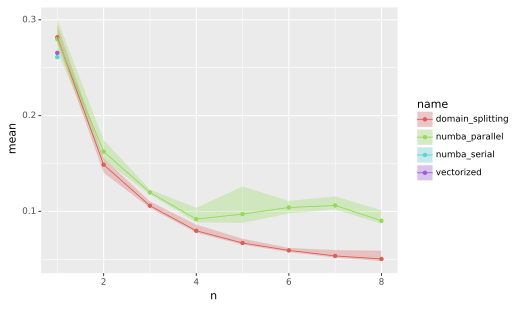

title: 'Exercise with Fractals'
teaching: 10
exercises: 50
---

:::questions
- Can we tackle a real problem now?
:::

:::objectives
- Create a strategy to parallelize existing code.
- Apply previous lessons.
:::

# The Mandelbrot and Julia fractals

This exercise uses Numpy and Matplotlib.

```python
from matplotlib import pyplot as plt
import numpy as np
```

We will be computing the famous [Mandelbrot
fractal](https://en.wikipedia.org/wiki/Mandelbrot_fractal).

:::callout
## Complex numbers
Complex numbers are a special representation of rotations and scalings in the two-dimensional plane. Multiplying two complex numbers is the same as taking a point, rotate it by an angle $\phi$ and scale it by the absolute value. Multiplying with a number $z \in \mathbb{C}$ by 1 preserves $z$. Multiplying a point at $i = (0, 1)$ (having a positive angle of 90 degrees and absolute value 1), rotates it anti-clockwise by 90 degrees. Then you might see that $i^2 = (-1, 0)$. The funny thing is that we can treat $i$ as any ordinary number, and all our algebra still works out. This is actually nothing short of a miracle! We can write a complex number

$$z = x + iy,$$

remember that $i^2 = -1$, and act as if everything is normal!
:::

The Mandelbrot set is the set of complex numbers $$c \in \mathbb{C}$$ for which the iteration

$$z_{n+1} = z_n^2 + c,$$

converges, starting from iteration at $z_0 = 0$. We can visualize the Mandelbrot set by plotting the
number of iterations needed for the absolute value $|z_n|$ to exceed 2 (for which it can be shown
that the iteration always diverges).

{alt="colorful rendering of mandelbrot set"}

We may compute the Mandelbrot as follows:

```python
max_iter = 256
width = 256
height = 256
center = -0.8 + 0.0j
extent = 3.0 + 3.0j
scale = max((extent / width).real, (extent / height).imag)

result = np.zeros((height, width), int)
for j in range(height):
    for i in range(width):
        c = center + (i - width // 2 + 1j * (j - height // 2)) * scale
        z = 0
        for k in range(max_iter):
            z = z**2 + c
            if (z * z.conjugate()).real > 4.0:
                break
        result[j, i] = k
```

Then we can plot with the following code:

```python
fig, ax = plt.subplots(1, 1, figsize=(10, 10))
plot_extent = (width + 1j * height) * scale
z1 = center - plot_extent / 2
z2 = z1 + plot_extent
ax.imshow(result**(1 / 3), origin='lower', extent=(z1.real, z2.real, z1.imag, z2.imag))
ax.set_xlabel("$\Re(c)$")
ax.set_ylabel("$\Im(c)$")
```

Things become really loads of fun when we zoom in. We can play around with the `center` and
`extent` values, and necessarily `max_iter`, to control our window:

```python
max_iter = 1024
center = -1.1195 + 0.2718j
extent = 0.005 + 0.005j
```

When we zoom in on the Mandelbrot fractal, we get smaller copies of the larger set!

{alt="rendering of mandelbrot zoom"}

:::challenge
## Exercise
Turn this into an efficient parallel program. What kind of speed-ups do you get?

::::solution
### Create a `BoundingBox` class
We start with a naive implementation. It may be convenient to define a `BoundingBox` class in a separate module `bounding_box.py`. We add methods to this class later on.

``` {.python file="src/mandelbrot/bounding_box.py"}
from dataclasses import dataclass
from typing import Optional
import numpy as np
import dask.array as da


@dataclass
class BoundingBox:
    width: int
    height: int
    center: complex
    extent: complex
    _scale: Optional[float] = None

    @property
    def scale(self):
        if self._scale is None:
            self._scale = max(self.extent.real / self.width,
                              self.extent.imag / self.height)
        return self._scale

    <<bounding-box-methods>>

test_case = BoundingBox(1024, 1024, -1.1195+0.2718j, 0.005+0.005j)
```
::::

::::solution
## Plotting function

``` {.python file="src/mandelbrot/plotting.py"}
import matplotlib  # type:ignore
matplotlib.use(backend="Agg")
from matplotlib import pyplot as plt
import numpy as np

from bounding_box import BoundingBox

def plot_fractal(box: BoundingBox, values: np.ndarray, ax=None):
    if ax is None:
        fig, ax = plt.subplots(1, 1, figsize=(10, 10))
    else:
        fig = None
    plot_extent = (box.width + 1j * box.height) * box.scale
    z1 = box.center - plot_extent / 2
    z2 = z1 + plot_extent
    ax.imshow(values, origin='lower', extent=(z1.real, z2.real, z1.imag, z2.imag),
              cmap=matplotlib.colormaps["viridis"])
    ax.set_xlabel("$\Re(c)$")
    ax.set_ylabel("$\Im(c)$")
    return fig, ax
```
::::

::::solution
## Some solutions
The natural approach with Python is to speed this up with Numba. Then, there are three ways to parallelize: first, letting Numba parallelize the function; second, doing a manual domain decomposition and using one of the many Python ways to run multi-threaded things; third, creating a vectorized function and parallelizing it using `dask.array`. This last option is almost always slower than `@njit(parallel=True)` and domain decomposition.

``` {.python file="src/mandelbrot/__init__.py"}

```
::::

::::solution
## Numba (serial)
When we port the core Mandelbrot function to Numba, we need to keep some best practices in mind:

- Don't pass composite objects other than Numpy arrays.
- Avoid acquiring memory inside a Numba function; rather, create an array in Python and then pass it to the Numba function.
- Write a Pythonic wrapper around the Numba function for easy use.

``` {.python file="src/mandelbrot/numba_serial.py"}
from typing import Any, Optional
import numba  # type:ignore
import numpy as np

from bounding_box import BoundingBox


@numba.njit(nogil=True)
def compute_mandelbrot_numba(
        result, width: int, height: int, center: complex,
        scale: complex, max_iter: int):
    for j in range(height):
        for i in range(width):
            c = center + (i - width // 2 + 1j * (j - height // 2)) * scale
            z = 0.0 + 0.0j
            for k in range(max_iter):
                z = z**2 + c
                if (z * z.conjugate()).real >= 4.0:
                    break
            result[j, i] = k
    return result


def compute_mandelbrot(
        box: BoundingBox, max_iter: int,
        result: Optional[np.ndarray[np.int64]] = None,
        throttle: Any = None):
    result = result if result is not None \
            else np.zeros((box.height, box.width), np.int64)
    return compute_mandelbrot_numba(
        result, box.width, box.height, box.center, box.scale,
        max_iter=max_iter)
```

### Numba `parallel=True`
We can parallelize loops directly with Numba. Pass the flag `parallel=True` and use `prange` to create the loop. Here, it is even more important to obtain the result array outside the context of Numba, otherwise the result will be slower than the serial version.

``` {.python file="src/mandelbrot/numba_parallel.py"}
from typing import Optional
import numba  # type:ignore
from numba import prange  # type:ignore
import numpy as np

from .bounding_box import BoundingBox


@numba.njit(nogil=True, parallel=True)
def compute_mandelbrot_numba(
        result, width: int, height: int, center: complex, scale: complex,
        max_iter: int):
    for j in prange(height):
        for i in prange(width):
            c = center + (i - width // 2 + (j - height // 2) * 1j) * scale
            z = 0.0+0.0j
            for k in range(max_iter):
                z = z**2 + c
                if (z*z.conjugate()).real >= 4.0:
                    break
            result[j, i] = k
    return result


def compute_mandelbrot(box: BoundingBox, max_iter: int,
                       throttle: Optional[int] = None):
    if throttle is not None:
        numba.set_num_threads(throttle)
    result = np.zeros((box.height, box.width), np.int64)
    return compute_mandelbrot_numba(
        result, box.width, box.height, box.center, box.scale,
        max_iter=max_iter)
```
::::

::::solution
## Domain splitting
We split the computation into a set of sub-domains. The `BoundingBox.split()` method is designed so that, if we deep-map the resulting list-of-lists, we can recombine the results using `numpy.block()`.

``` {.python #bounding-box-methods}
def split(self, n):
    """Split the domain in nxn subdomains, and return a grid of BoundingBoxes."""
    w = self.width // n
    h = self.height // n
    e = self.scale * w + self.scale * h * 1j
    x0 = self.center - e * (n / 2 - 0.5)
    return [[BoundingBox(w, h, x0 + i * e.real + j * e.imag * 1j, e)
             for i in range(n)]
            for j in range(n)]
```

To perform the computation in parallel, let's go ahead and choose the most difficult path: `asyncio`. There are other ways to do this, like setting up a number of threads or using Dask. However, `asyncio` is available in Python natively. In the end, the result is very similar to what we would get using `dask.delayed`.

This may seem as a lot of code, but remember: we only use Numba to compile the core part and then Asyncio to parallelize. The progress bar is a bit of flutter and the semaphore is only there to throttle the computation to fewer cores. Even then, this solution is the most extensive by far but also the fastest.

``` {.python file="src/mandelbrot/domain_splitting.py"}
from typing import Optional
import numpy as np
import asyncio
from psutil import cpu_count  # type:ignore
from contextlib import nullcontext

from .bounding_box import BoundingBox
from .numba_serial import compute_mandelbrot as mandelbrot_serial


async def a_compute_mandelbrot(
        box: BoundingBox,
        max_iter: int,
        semaphore: Optional[asyncio.Semaphore]):
    async with semaphore or nullcontext():
        result = np.zeros((box.height, box.width), np.int64)
        await asyncio.to_thread(
                mandelbrot_serial, box, max_iter, result=result)
    return result


async def a_domain_split(box: BoundingBox, max_iter: int,
                         sem: Optional[asyncio.Semaphore]):
    n_cpus = cpu_count(logical=True)
    split = box.split(n_cpus)
    split_result = await asyncio.gather(
        *(asyncio.gather(
            *(a_compute_mandelbrot(b, max_iter, sem)
              for b in row))
          for row in split))
    return np.block(split_result)


def compute_mandelbrot(box: BoundingBox, max_iter: int,
                       throttle: Optional[int] = None):
    sem = asyncio.Semaphore(throttle) if throttle is not None else None
    return asyncio.run(a_domain_split(box, max_iter, sem))
```
::::

::::solution
## Numba vectorize
Another solution is to use Numba's `@guvectorize` decorator. The speed-up (on my machine) is not as dramatic as with the domain decomposition, though.

``` {.python #bounding-box-methods}
def grid(self):
    """Return the complex values on the grid in a 2d array."""
    x0 = self.center - self.extent / 2
    x1 = self.center + self.extent / 2
    g = np.mgrid[x0.imag:x1.imag:self.height*1j,
                 x0.real:x1.real:self.width*1j]
    return g[1] + g[0]*1j

def da_grid(self):
    """Return the complex values on the grid in a 2d array."""
    x0 = self.center - self.extent / 2
    x1 = self.center + self.extent / 2
    x = np.linspace(x0.real, x1.real, self.width, endpoint=False)
    y = np.linspace(x0.imag, x1.imag, self.height, endpoint=False)
    g = da.meshgrid(x, y)
    return g[1] + g[0]*1j
```

``` {.python file="src/mandelbrot/vectorized.py"}
from typing import Any
from numba import guvectorize, int64, complex128  # type:ignore
import numpy as np

from .bounding_box import BoundingBox


@guvectorize([(complex128[:, :], int64, int64[:, :])],
             "(n,m),()->(n,m)",
             nopython=True)
def compute_mandelbrot_numba(inp, max_iter: int, result):
    for j in range(inp.shape[0]):
        for i in range(inp.shape[1]):
            c = inp[j, i]
            z = 0.0+0.0j
            for k in range(max_iter):
                z = z**2 + c
                if (z*z.conjugate()).real >= 4.0:
                    break
            result[j, i] = k


def compute_mandelbrot(box: BoundingBox, max_iter: int, throttle: Any = None):
    result = np.zeros((box.height, box.width), np.int64)
    c = box.grid()
    compute_mandelbrot_numba(c, max_iter, result)
    return result
```
::::

::::solution
## Benchmarks

{alt="performance curves"}

``` {.python file="src/mandelbrot/bench_all.py"}
from typing import Optional
import timeit
from . import numba_serial, numba_parallel, vectorized, domain_splitting
from .bounding_box import BoundingBox, test_case


compile_box = BoundingBox(16, 16, 0.0+0.0j, 1.0+1.0j)
timing_box = test_case


def compile_run(m):
    m.compute_mandelbrot(compile_box, 1)


def timing_run(m, throttle: Optional[int] = None):
    m.compute_mandelbrot(timing_box, 1024, throttle=throttle)


modules = ["numba_serial:1", "vectorized:1"] \
        + [f"domain_splitting:{n}" for n in range(1, 9)] \
        + [f"numba_parallel:{n}" for n in range(1, 9)]


if __name__ == "__main__":
    with open("timings.txt", "w") as out:
        headings = ["name", "n", "min", "mean", "max"]
        print(f"{headings[0]:<20}" \
              f"{headings[1]:>10}" \
              f"{headings[2]:>10}" \
              f"{headings[3]:>10}" \
              f"{headings[4]:>10}",
              file=out)
        for mn in modules:
            m, n = mn.split(":")
            n_cpus = int(n)
            setup = f"from mandelbrot.bench_all import timing_run, compile_run\n" \
                    f"from mandelbrot import {m}\n" \
                    f"compile_run({m})"
            times = timeit.repeat(
                stmt=f"timing_run({m}, {n_cpus})",
                setup=setup,
                number=1,
                repeat=50)
            print(f"{m:20}" \
                  f"{n_cpus:>10}" \
                  f"{min(times):10.5g}" \
                  f"{sum(times)/len(times):10.5g}" \
                  f"{max(times):10.5g}",
                  file=out)

    import pandas as pd
    from plotnine import ggplot, geom_point, geom_ribbon, geom_line, aes
    timings = pd.read_table("timings.txt", delimiter=" +", engine="python")
    plot = ggplot(timings, aes(x="n", y="mean", ymin="min", ymax="max",
                               color="name", fill="name")) \
        + geom_ribbon(alpha=0.3, color="none") \
        + geom_point() + geom_line()
    plot.save("mandelbrot-timings.svg")
```
::::
:::

## Extra: Julia sets
For each value $$c$$ we can compute the Julia set, namely the set of starting values $$z_1$$ for
which the iteration over $$z_{n+1}=z_n^2 + c$$ converges. Every location on the Mandelbrot image
corresponds to its own unique Julia set.

```python
max_iter = 256
center = 0.0+0.0j
extent = 4.0+3.0j
scale = max((extent / width).real, (extent / height).imag)

result = np.zeros((height, width), int)
c = -1.1193+0.2718j

for j in range(height):
    for i in range(width):
        z = center + (i - width // 2 + (j - height // 2)*1j) * scale
        for k in range(max_iter):
            z = z**2 + c
            if (z * z.conjugate()).real > 4.0:
                break
        result[j, i] = k
```

If we take the centre of the last image, we get the following rendering of the Julia set:

{alt="colorful rendering of a Julia set"}

:::challenge
## Generalize
Can you generalize your Mandelbrot code to compute both the Mandelbrot and the Julia sets efficiently, while reusing as much code as possible?
:::

:::keypoints
- Actually making code faster is not always straightforward.
- Easy one-liners *can* get you 80% of the way.
- Writing clean and modular code often makes parallelization easier later on.
:::

