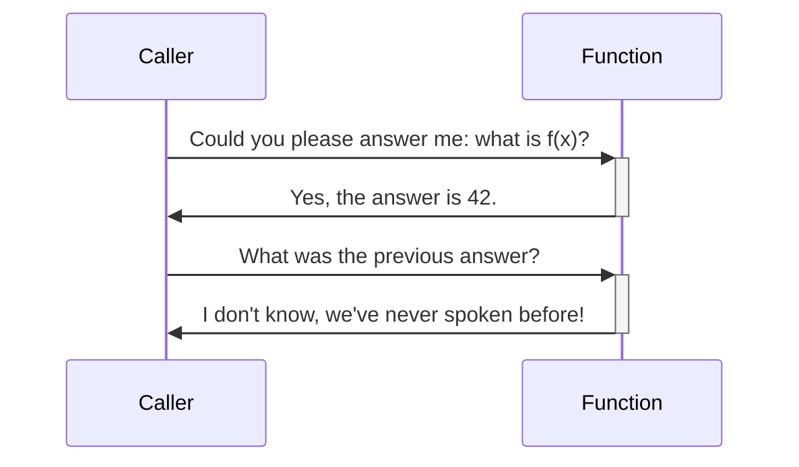
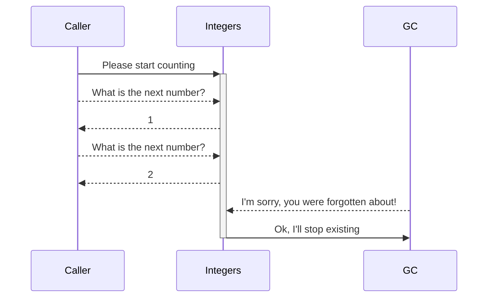
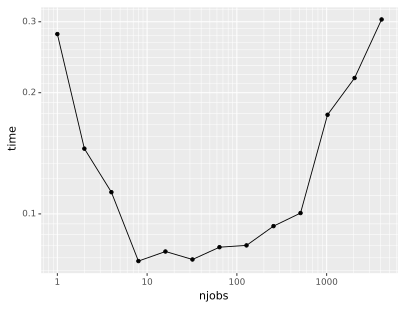

do---
title: 'Asyncio'
teaching: 30
exercises: 10
---

:::questions
- What is Asyncio?
- When is Asyncio useful?
:::

:::objectives
- Understand the difference between a function and a coroutine.
- Know the rudimentary basics of `asyncio`.
- Perform parallel computations in `asyncio`.
:::

# Introduction to Asyncio
Asyncio stands for "asynchronous IO" and, as you might have guessed, has little to do with either asynchronous work or doing IO. In general, the adjective asynchronous describes objects or events not coordinated in time. In fact, the `asyncio` system is more like a set of gears carefully tuned to run a multitude of tasks *as if* a lot of OS threads were running. In the end, they are all powered by the same crank. The gears in `asyncio` are called **coroutines** and its teeth move other coroutines wherever you find the `await` keyword.

The main application for `asyncio` is hosting back-ends for web services, where a lot of tasks may be waiting for each other while the server remains responsive to new events. In that regard, `asyncio` is a little bit outside the domain of computational science. Nevertheless, you may encounter Asyncio code in the wild, and you *can* do parallelism with Asyncio if you want higher-level abstraction without `dask` or similar alternatives.

Many modern programming languages do have features very similar to `asyncio`.

## Run-time
The distinctive point of `asyncio` is a formalism for carrying out work that is different from usual functions. We need to look deeper into functions to appreciate the distinction.

### Call stacks
A function call is best understood in terms of a stack-based system. When calling a function, you give it its arguments and temporarily forget what you were doing. Or, rather, you push on a stack and forget whatever you were doing. Then, you start working with the given arguments on a clean sheet (called a stack frame) until you obtain the function result. When you return to the stack, you remember only this result and recall what you originally needed it for.
In this manner, every function call pushes a frame onto the stack and every return statement has us popping back to the previous frame.

[](https://mermaid.live/edit#pako:eNp1kL1Ow0AQhF9luSYgHApEdUUogpCoKRCSm8U3JpbtXXM_NlGUd-dMYgqkdKvb-Wb25mAqdTDWBHwlSIWnhj8996UQcRWbkSNoy10HPz-dpvVmc_ucJK9VLG01dY72mmjowAHEEiZ46mFp2nGkJlB9_X3zOBssWLZYn8wsvSMUFHd_YNY_3N9dinubLScOv8TgMTaawhm9GPFCTmUVqRWdCpqwGkGCMYeFQVsIfaBWj6uZF81f1nm30BCXk3TpxeFfM6YwPXzPjctFHmZJafJ1PUpj8-jYt6Up5Zh1nKK-7qUyNvqEwqTBZZ9z6cbW3AUcfwB5sYta)

<details>
<summary>Mermaid code for above diagram</summary>


</details>

Crucially, when we pop back, we also forget the stack frame inside the function. This way of doing always keeps a single conscious stream of thought. Function calls can be evaluated by a single active agent.

### Coroutines
:::instructor
This section goes rather in depth into coroutines. This is meant to nurture the correct mental model about what goes on with `asyncio`.
:::

Working with coroutines changes things a bit. The coroutine keeps on existing and its context is not forgotten when a coroutine returns a result. Python has several forms of coroutines and the simplest is a **generator**. For example, the following generator produces all integers (if you wait long enough):

```python
def integers():
  a = 1
  while True:
    yield a
    a += 1
```

Then:

```python
for i in integers():
  print(i)
  if i > 10:   # or this would take a while
    break
```

or:

```python
from itertools import islice
islice(integers(), 0, 10)
```

```output
[1, 2, 3, 4, 5, 6, 7, 8, 9, 10]
```

[](https://mermaid.live/edit#pako:eNqtkT1Pw0AMhv-KuYWBdIDxhjAEqepUJAaWLG7OTU-9j-DzlUZV_zsXhQgqMbJZ9vPafu2L6qIhpVWij0yhoxeLPaNvAwB2Yk8oBA06Rzyl5mhV1w-bINQTJw2vjjARJEEW6GIOYkP_Cy70D_x-QAGbQA4Egc4CIfsd8fPEL9SkmLUaHv-r0dNUCLG4iSdiWNIUDAwcF8uG_jC9bm5Hb-49pMg8VjDGDJ_EBPvIfRShALiLWe5u1qjr1brRsD1WRetcOVUcgM42zZdSlfLEHq0pf7hMylYVW55apUtokI-tasO1cJglvo2hU1o4U6XyYMqu3z9Teo8u0fUL2jOgcw)

<details>
<summary>Mermaid code for above diagram</summary>


</details>

:::challenge
## Challenge: generate all even numbers
Can you write a generator for all even numbers? Reuse `integers()`. Extra: Can you generate the Fibonacci sequence?

::::solution
```python
def even_integers():
  for i in integers():
    if i % 2 == 0:
      yield i
```

or

```python
def even_integers():
  return (i for i in integers() if i % 2 == 0)
```

For the Fibonacci series:

```python
def fib():
  a, b = 1, 1
  while True:
    yield a
    a, b = b, a + b
```
::::
:::

The generator gives away control, passing back a value and expecting to receive control one more time, if faith has it. All meanings of the keyword `yield` apply here: the coroutine yields control and produces a yield, as if we were harvesting a crop.

Conceptually, a generator entails one-way traffic only: we get output. However, we can use `yield` also to send information to a coroutine. For example, this coroutine prints whatever you send to it:

```python
def printer():
  while True:
    x = yield
    print(x)

p = printer()
next(p)   # we need to advance the coroutine to the first yield
p.send("Mercury")
p.send("Venus")
p.send("Earth")
```

:::challenge
## Challenge: line numbers
Change `printer` to add line numbers to the output.

::::solution
## Solution

```python
def printer():
  lineno = 1
  while True:
    x = yield
    print(f"{lineno:03} {x}")
    lineno += 1
```
::::
:::

In practice, the send-form of coroutines is hardly ever used. Cases for needing it are infrequent, and chances are that nobody will understand your code. Asyncio has largely superseded this usage.

The working of `asyncio` is only a small step farther than that of coroutines. The intuition is to use coroutines to build a collaborative multi-threading environment. Most modern operating systems assign some time to execution threads and take back control pre-emptively to do something else. In **collaborative multi-tasking**, every worker knows to be part of a collaborative environment and yields control to the scheduler voluntarily. Creating such a system with coroutines and `yield` is possible in principle, but is not straightforward especially owing to the propagation of exceptions.

## Syntax
`asyncio` itself is a library in standard Python and is a core component for actually using the associated async syntax. Two keywords are especially relevant here: `async` and `await`.

`async` is a modifier keyword that makes any subsequent syntax behave consistently with the asynchronous run-time.

`await` is used inside a coroutine to wait until another coroutine yields a result. Effectively, the scheduler takes control again and may decide to return it when a result is present.

# A first program
Jupyter understands asynchronous code, so you can `await` futures in any cell:

```python
import asyncio

async def counter(name):
  for i in range(5):
    print(f"{name:<10} {i:03}")
    await asyncio.sleep(0.2)

await counter("Venus")
```

``` {.output}
Venus      000
Venus      001
Venus      002
Venus      003
Venus      004
```

We can have coroutines work concurrently when we `gather` them:

```python
await asyncio.gather(counter("Earth"), counter("Moon"))
```

```output
Earth      000
Moon       000
Earth      001
Moon       001
Earth      002
Moon       002
Earth      003
Moon       003
Earth      004
Moon       004
````


Note that, although the Earth counter and Moon counter seem to operate at the same time, the scheduler is actually alternating them in a single thread! If you work outside of Jupyter, you need an asynchronous main function and must run it using `asyncio.run`. A typical program will look like this:

```python
import asyncio

...

async def main():
    ...

if __name__ == "__main__":
    asyncio.run(main())
```

Asyncio is as contagious as Dask. Any higher-level code must be async once you have some async low-level code: [it's turtles all the way down](https://en.wikipedia.org/wiki/Turtles_all_the_way_down)! You may be tempted to implement `asyncio.run` in the middle of your code and interact with the asynchronous parts. Multiple active Asyncio run-times will get you into troubles, though. Mixing Asyncio and classic code is possible in principle, but is considered bad practice.

## Timing asynchronous code
Jupyter works very well with `asyncio` except for line magics and cell magics. We must then write our own timer.

:::instructor
It may be best to have participants copy and paste this snippet from the collaborative document. You may want to explain what a context manager is, but don't overdo it. This is advanced code and may scare off novices.
:::

``` {.python #async-timer}
from dataclasses import dataclass
from typing import Optional
from time import perf_counter
from contextlib import asynccontextmanager


@dataclass
class Elapsed:
    time: Optional[float] = None


@asynccontextmanager
async def timer():
    e = Elapsed()
    t = perf_counter()
    yield e
    e.time = perf_counter() - t
```

Now we can write:

```python
async with timer() as t:
  await asyncio.sleep(0.2)
print(f"that took {t.time} seconds")
```

```output
that took 0.20058414503000677 seconds
```

Understanding these few snippets of code requires advanced knowledge of Python. Rest assured that both classic coroutines and `asyncio` are complex topics that we cannot cover completely. However, we can time the execution of our code now!

## Compute $\pi$ again
As a reminder, here is our Numba code for computing $\pi$:

``` {.python #calc-pi-numba}
import random
import numba


@numba.njit(nogil=True)
def calc_pi(N):
    M = 0
    for i in range(N):
        # Simulate impact coordinates
        x = random.uniform(-1, 1)
        y = random.uniform(-1, 1)

        # True if impact happens inside the circle
        if x**2 + y**2 < 1.0:
            M += 1
    return 4 * M / N
```

We can send this work to another thread with `asyncio.to_thread`:

```python
async with timer() as t:
    await asyncio.to_thread(calc_pi, 10**7)
```

:::challenge
## Gather multiple outcomes
We have already seen that `asyncio.gather` gathers multiple coroutines. Here, gather several `calc_pi` computations and time them.

::::solution
```python
async with timer() as t:
    result = await asyncio.gather(
       asyncio.to_thread(calc_pi, 10**7),
       asyncio.to_thread(calc_pi, 10**7))
```
::::
:::

We can put this into a new function `calc_pi_split`:

``` {.python #async-calc-pi}
async def calc_pi_split(N, M):
    lst = await asyncio.gather(*(asyncio.to_thread(calc_pi, N) for _ in range(M)))
    return sum(lst) / M
```

and then verify the speed-up that we get:

``` {.python #async-calc-pi-main}
async with timer() as t:
    pi = await asyncio.to_thread(calc_pi, 10**8)
    print(f"Value of π: {pi}")

print(f"that took {t.time} seconds")
```

```output
Value of π: 3.1418552
that took 2.3300534340087324 seconds
```

``` {.python #async-calc-pi-main}
async with timer() as t:
    pi = await calc_pi_split(10**7, 10)
    print(f"Value of π: {pi}")

print(f"that took {t.time} seconds")
```

```output
Value of π: 3.1416366400000006
that took 0.5876454019453377 seconds
```

# Working with `asyncio` outside Jupyter
Jupyter already has an asynchronous loop running for us. In order to run scripts outside Jupyter you should write an asynchronous main function and call it using `asyncio.run`.

:::challenge
## Compute $\pi$ in a script
Collect in a script what we have done so far to compute $\pi$ in parallel, and run it.

::::solution
Ensure that you create an `async` main function, and run it using `asyncio.run`. Create a small module called `calc_pi`.

``` {.python file="src/calc_pi/__init__.py"}
# file: calc_pi/__init__.py
# may remain empty
```

Put the Numba code in a separate file `calc_pi/numba.py`.

``` {.python file="src/calc_pi/numba.py"}
# file: calc_pi/numba.py

<<calc-pi-numba>>
```

Put the `async_timer` function in a separate file `async_timer.py`.

``` {.python file="src/async_timer.py"}
# file: async_timer.py

<<async-timer>>
```

``` {.python file="src/calc_pi/async_pi.py"}
# file: calc_pi/async_pi.py

import asyncio
from async_timer import timer
from .numba import calc_pi

<<async-calc-pi>>

async def main():
    calc_pi(1)
    <<async-calc-pi-main>>

if __name__ == "__main__":
    asyncio.run(main())
```

You may run this script using `python -m calc_pi.async_pi`.
::::
:::

:::challenge
## Efficiency
Play with different subdivisions in `calc_pi_split` keeping `M*N` constant. How much overhead do you see?

::::solution
``` {.python file="src/calc_pi/granularity.py"}
import asyncio
import pandas as pd
from plotnine import ggplot, geom_line, geom_point, aes, scale_y_log10, scale_x_log10

from .numba import calc_pi
from .async_pi import calc_pi_split
from async_timer import timer

calc_pi(1)  # compile the numba function


async def main():
    timings = []
    for njobs in [2**i for i in range(13)]:
        jobsize = 2**25 // njobs
        print(f"{jobsize} - {njobs}")
        async with timer() as t:
            await calc_pi_split(jobsize, njobs)
        timings.append((jobsize, njobs, t.time))

    timings = pd.DataFrame(timings, columns=("jobsize", "njobs", "time"))
    plot = ggplot(timings, aes(x="njobs", y="time")) \
        + geom_line() + geom_point() + scale_y_log10() + scale_x_log10()
    plot.save("asyncio-timings.svg")

if __name__ == "__main__":
    asyncio.run(main())
```

{alt="a dip at njobs=10 and overhead ~0.1ms per task"}

The work takes about 0.1 s more when using 1000 tasks. So, assuming that the total overhead is distributed uniformly among the tasks, we observe that the overhead is around 0.1 ms per task.
::::
:::

:::keypoints
- Use the `async` keyword to write asynchronous code.
- Use `await` to call coroutines.
- Use `asyncio.gather` to collect work.
- Use `asyncio.to_thread` to perform CPU intensive tasks.
- Inside a script: always create an asynchronous `main` function, and run it with `asyncio.run`.
:::

