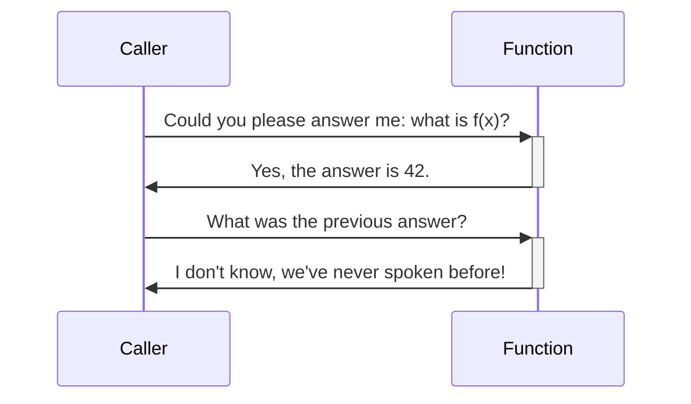
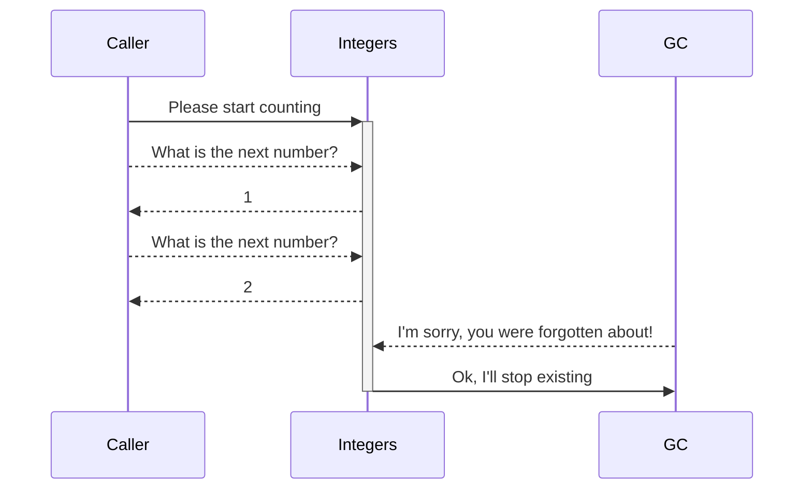

:::questions
- What is Asyncio?
- When is asyncio usefull?
:::

:::objectives
- Understand the difference between a coroutine and a function.
- Know the rudimentary basics of `asyncio`.
- Perform parallel computations in `asyncio`.
:::

# Introduction to Asyncio
Asyncio stands for "asynchronous IO", and as you might have guessed it has little to do with either asynchronous work or doing IO. In general, asynchronous is an adjective describing objects or events that are not coordinated in time. In fact, the `asyncio` system is more like a carefully tuned set of gears running a multitude of tasks *as if* you have a lot of OS threads running. In the end they are all powered by the same crank. The gears in `asyncio` are called **coroutines**, its teeth moving other coroutines wherever you find the `await` keyword.

The main application for `asyncio` is hosting back-ends for web services, where a lot of tasks may be waiting on each other, while the server still needs to be responsive to new events. In that respect, `asyncio` is a little bit outside the domain of computational science. Nevertheless, you may encounter async code in the wild, and you *can* do parallelism with `asyncio` if you want a higher level abstraction but don't want to depend on `dask` or a similar alternative.

Many modern programming languages have features that are very similar to `asyncio`.

## Run-time
The main point of `asyncio` is that it offers a different formalism for doing work than what you're used to from functions. To see what that means, we need to understand functions a bit better.

### Call stacks
A function call is best understood in terms of a stack based system. When you call a function, you give it its arguments and forget for the moment what you were doing. Or rather, whatever you were doing, push it on a stack and forget about it. Then, with a clean sheet (called a stack frame), you start working on the given arguments until you arrive at a result. This result is what you remember, when you go back to the stack to see what you needed it for in the first place.
In this manner, every function call pushes a frame to the stack, and every return statement, we pop back to the previous.

[](https://mermaid.live/edit#pako:eNp1kL1Ow0AQhF9luSYgHApEdUUogpCoKRCSm8U3JpbtXXM_NlGUd-dMYgqkdKvb-Wb25mAqdTDWBHwlSIWnhj8996UQcRWbkSNoy10HPz-dpvVmc_ucJK9VLG01dY72mmjowAHEEiZ46mFp2nGkJlB9_X3zOBssWLZYn8wsvSMUFHd_YNY_3N9dinubLScOv8TgMTaawhm9GPFCTmUVqRWdCpqwGkGCMYeFQVsIfaBWj6uZF81f1nm30BCXk3TpxeFfM6YwPXzPjctFHmZJafJ1PUpj8-jYt6Up5Zh1nKK-7qUyNvqEwqTBZZ9z6cbW3AUcfwB5sYta)

<details>
<summary>Mermaid code for above diagram</summary>


</details>

Crucially, when we pop back, we forget about the stack frame inside the function. This way, there is always a single concious stream of thought. Function calls can be evaluated by a single active agent.

### Coroutines
:::instructor
This section goes rather in depth on coroutines. This is meant to grow the correct mental model about what's going on with `asyncio`.
:::

When working with coroutines, things are a bit different. When a result is returned from a coroutine, the coroutine keeps existing, its context is not forgotten. Coroutines exist in Python in several forms, the simplest being a **generator**. The following generator produces all integers (if you wait long enough):

```python
def integers():
  a = 1
  while True:
    yield a
    a += 1
```

Then

```python
for i in integers():
  print(i)
  if i > 10:   # or this would take a while
    break
```

or

```python
from itertools import islice
islice(integers(), 0, 10)
```

```output
[1, 2, 3, 4, 5, 6, 7, 8, 9, 10]
```

[](https://mermaid.live/edit#pako:eNqtkT1Pw0AMhv-KuYWBdIDxhjAEqepUJAaWLG7OTU-9j-DzlUZV_zsXhQgqMbJZ9vPafu2L6qIhpVWij0yhoxeLPaNvAwB2Yk8oBA06Rzyl5mhV1w-bINQTJw2vjjARJEEW6GIOYkP_Cy70D_x-QAGbQA4Egc4CIfsd8fPEL9SkmLUaHv-r0dNUCLG4iSdiWNIUDAwcF8uG_jC9bm5Hb-49pMg8VjDGDJ_EBPvIfRShALiLWe5u1qjr1brRsD1WRetcOVUcgM42zZdSlfLEHq0pf7hMylYVW55apUtokI-tasO1cJglvo2hU1o4U6XyYMqu3z9Teo8u0fUL2jOgcw)

<details>
<summary>Mermaid code for above diagram</summary>


</details>

:::challenge
## Challenge: generate all even numbers
Can you write a generator that generates all even numbers? Try to reuse `integers()`. Extra: Can you generate the Fibonacci numbers?

::::solution
```python
def even_integers():
  for i in integers():
    if i % 2 == 0:
      yield i
```

or

```python
def even_integers():
  return (i for i in integers() if i % 2 == 0)
```

For the Fibonacci numbers:

```python
def fib():
  a, b = 1, 1
  while True:
    yield a
    a, b = b, a + b
```
::::
:::

The generator gives away control, passing a value back, expecting, maybe, if faith has it, that control will be passed back to it in the future. The keyword `yield` applies in all its meanings: control is yielded, and we have a yield in terms of harvesting a crop.

A generator conceptually only has one-way traffic: we get output. We can also use `yield` the other way around: it can be used to send information to a coroutine. For instance: we can have a coroutine that prints whatever you send to it.

```python
def printer():
  while True:
    x = yield
    print(x)

p = printer()
next(p)   # we need to advance the coroutine to the first yield
p.send("Mercury")
p.send("Venus")
p.send("Earth")
```

:::challenge
## Challenge: line numbers
Change `printer` to add line numbers to the output.

::::solution
## Solution

```python
def printer():
  lineno = 1
  while True:
    x = yield
    print(f"{lineno:03} {x}")
```
::::
:::

In practice, the `send` form of coroutines is hardly ever used. Cases where you'd need it are rare, and chances are noone will understand your code. Where it was needed before, its use is now largely superceded by `asyncio`.

Now that you have seen coroutines, it is a small step towards `asyncio`. The idea is that you can use coroutines to build a collaborative multi-threading environment. In most modern operating systems, execution threads are given some time, and then when the OS needs to do something else, control is taken away pre-emptively. In **collaborative multi-tasking**, every worker knows it is part of a collaborative, and it voluntarily yields control to the scheduler. With coroutines and `yield` you should be able to see that it is possible to create such a system, but it is not so straight forward, especially when you start to consider the propagation of exceptions.

## Syntax
While `asyncio` itself is a library in standard Python, this library is actually a core component for using the associated async syntax. There are two keywords here: `async` and `await`.

`async` Is a modifier keyword that modifies the behaviour of any subsequent syntax to behave in a manner that is consistent with the asynchronous run-time.

`await` Is used inside a coroutine to wait for another coroutine to yield a result. Effectively, control is passed back to the scheduler, which may decide to give back control when a result is present.

# A first program
Jupyter understands asynchronous code, so you can `await` futures in any cell.

```python
import asyncio

async def counter(name):
  for i in range(5):
    print(f"{name:<10} {i:03}")
    await asyncio.sleep(0.2)

await counter("Venus")
```

``` {.output}
Venus      000
Venus      001
Venus      002
Venus      003
Venus      004
```

We can have coroutines work concurrently when we `gather` two coroutines.

```python
await asyncio.gather(counter("Earth"), counter("Moon"))
```

```output
Earth      000
Moon       000
Earth      001
Moon       001
Earth      002
Moon       002
Earth      003
Moon       003
Earth      004
Moon       004
````


Note that, although the Earth counter and Moon counter seem to operate at the same time, in actuality they are alternated by the scheduler and still running in a single thread! If you work outside the confines of Jupyter, you need to make sure to create an asynchronous main function and run it using `asyncio.run`. A typical program will look like this:

```python
import asyncio

...

async def main():
    ...

if __name__ == "__main__":
    asyncio.run(main)
```

Asyncio, just like we saw with Dask, is contagious. Once you have async code at some low level, higher level code also needs to be async: [it's turtles all the way down](https://en.wikipedia.org/wiki/Turtles_all_the_way_down)! You may be tempted to do `asyncio.run` somewhere from the middle of your normal code to interact with the asyncronous parts. This can get you into trouble though, when you get multiple active asyncio run-times. While it is in principle possible to mix asyncio and classic code, it is in general considered bad practice to do so.

## Timing asynchronous code
While Jupyter works very well with `asyncio`, one thing that doesn't work is line or cell-magic. We'll have to write our own timer.

:::instructor
It may be best to let participants copy paste this snippet from the collaborative document. You may want to explain what a context manager is, but don't overdo it. This is advanced code and may scare off novices.
:::

``` {.python #async-timer}
from dataclasses import dataclass
from typing import Optional
from time import perf_counter
from contextlib import asynccontextmanager


@dataclass
class Elapsed:
    time: Optional[float] = None


@asynccontextmanager
async def timer():
    e = Elapsed()
    t = perf_counter()
    yield e
    e.time = perf_counter() - t
```

Now we can write:

```python
async with timer() as t:
  await asyncio.sleep(0.2)
print(f"that took {t.time} seconds")
```

```output
that took 0.20058414503000677 seconds
```

These few snippets of code require advanced Python knowledge to understand. Rest assured that both classic coroutines and `asyncio` are a large topic to cover, and we're not going to cover all of it. At least, we can now time the execution of our code!

## Compute $\pi$ again
As a reminder, here is our Numba code to compute $\pi$.

``` {.python #calc-pi-numba}
import random
import numba


@numba.njit(nogil=True)
def calc_pi(N):
    M = 0
    for i in range(N):
        # Simulate impact coordinates
        x = random.uniform(-1, 1)
        y = random.uniform(-1, 1)

        # True if impact happens inside the circle
        if x**2 + y**2 < 1.0:
            M += 1
    return 4 * M / N
```

We can send work to another thread with `asyncio.to_thread`.

```python
async with timer() as t:
    await asyncio.to_thread(calc_pi, 10**7)
```

:::challenge
## Gather multiple outcomes
We've seen that we can gather multiple coroutines using `asyncio.gather`. Now gather several `calc_pi` computations, and time them.

::::solution
```python
async with timer() as t:
    result = await asyncio.gather(
       asyncio.to_thread(calc_pi, 10**7),
       asyncio.to_thread(calc_pi, 10**7))
```
::::
:::

We can put this into a new function `calc_pi_split`:

``` {.python #async-calc-pi}
async def calc_pi_split(N, M):
    lst = await asyncio.gather(*(asyncio.to_thread(calc_pi, N) for _ in range(M)))
    return sum(lst) / M
```

Now, see if we get a speed up.

``` {.python #async-calc-pi-main}
async with timer() as t:
    pi = await asyncio.to_thread(calc_pi, 10**8)
    print(f"Value of π: {pi}")

print(f"that took {t.time} seconds")
```

```output
Value of π: 3.1418552
that took 2.3300534340087324 seconds
```

``` {.python #async-calc-pi-main}
async with timer() as t:
    pi = await calc_pi_split(10**7, 10)
    print(f"Value of π: {pi}")

print(f"that took {t.time} seconds")
```

```output
Value of π: 3.1416366400000006
that took 0.5876454019453377 seconds
```

# Working with `asyncio` outside Jupyter
Jupyter already has an asyncronous loop running for us. If you want to run scripts outside Jupyter you should write an asynchronous main function and call it using `asyncio.run`.

:::challenge
## Compute $\pi$ in a script
Collect what we have done so far to compute $\pi$ in parallel into a script and run it.

::::solution
Make sure that you create an `async` main function, and run it using `asyncio.run`. Create a small module called `calc_pi`.

``` {.python file="src/calc_pi/__init__.py"}
# file: calc_pi/__init__.py
# may remain empty
```

Put the Numba code in a separate file `calc_pi/numba.py`.

``` {.python file="src/calc_pi/numba.py"}
# file: calc_pi/numba.py

<<calc-pi-numba>>
```

Put the async timer function in a separate file `async_timer.py`.

``` {.python file="src/async_timer.py"}
# file: async_timer.py

<<async-timer>>
```

``` {.python file="src/calc_pi/async_pi.py"}
# file: calc_pi/async_pi.py

import asyncio
from async_timer import timer
from .numba import calc_pi

<<async-calc-pi>>

async def main():
    calc_pi(1)
    <<async-calc-pi-main>>

if __name__ == "__main__":
    asyncio.run(main())
```

You may run this using `python -m calc_pi.async_pi`.
::::
:::

:::challenge
## Efficiency
Play with different subdivisions for `calc_pi_split` such that `M*N` remains constant. How much overhead do you see?

::::solution
``` {.python file="src/calc_pi/granularity.py"}
import asyncio
import pandas as pd
from plotnine import ggplot, geom_line, geom_point, aes, scale_y_log10, scale_x_log10

from .numba import calc_pi
from .async_pi import calc_pi_split
from async_timer import timer

calc_pi(1)  # compile the numba function


async def main():
    timings = []
    for njobs in [2**i for i in range(13)]:
        jobsize = 2**25 // njobs
        print(f"{jobsize} - {njobs}")
        async with timer() as t:
            await calc_pi_split(jobsize, njobs)
        timings.append((jobsize, njobs, t.time))

    timings = pd.DataFrame(timings, columns=("jobsize", "njobs", "time"))
    plot = ggplot(timings, aes(x="njobs", y="time")) \
        + geom_line() + geom_point() + scale_y_log10() + scale_x_log10()
    plot.save("asyncio-timings.svg")

if __name__ == "__main__":
    asyncio.run(main())
```

{alt="a dip at njobs=10 and overhead ~0.1ms per task"}

The work takes about 0.1s more when using 1000 tasks, so assuming that overhead scales linearly with the amount of tasks, we can learn that the overhead is around 0.1ms per task.
::::
:::

:::keypoints
- Use the `async` keyword to write asynchronous code.
- Use `await` to call coroutines.
- Use `asyncio.gather` to collect work.
- Use `asyncio.to_thread` to perform CPU intensive tasks.
- Inside a script: always make an asynchronous `main` function, and run it with `asyncio.run`.
:::

