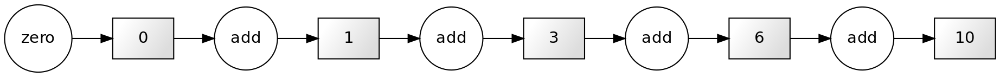
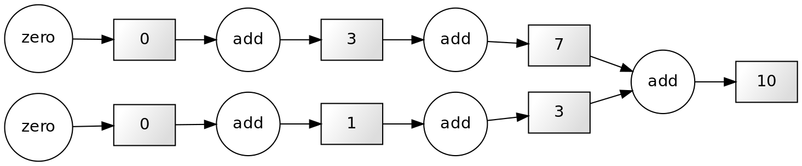
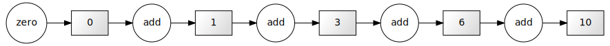
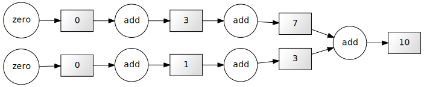
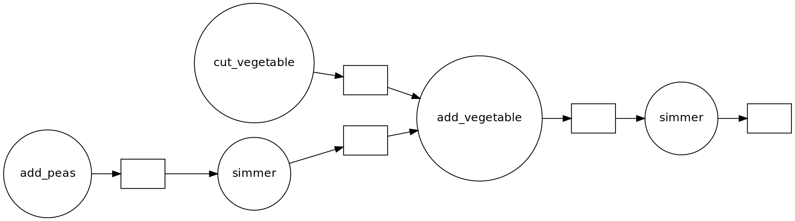

:::::::::::::::::::::::::::::::::::::: questions

- What problems are we solving, and what are we **not** discussing?
- Why do we use Python?
- What is parallel programming?
- Why can writing a parallel program be challenging?

::::::::::::::::::::::::::::::::::::::::::::::::

::::::::::::::::::::::::::::::::::::: objectives

- Recognize serial and parallel patterns.
- Identify problems that can be parallelized.
- Understand a dependency diagram.

::::::::::::::::::::::::::::::::::::::::::::::::

# Common problems

:::callout
## What problems are we solving?
Ask around what problems participants encountered: "Why did you sign up?"
Specifically: "Which task in your field of expertise do you want to parallelize?"
:::

Most problems will fit in either category:
- I wrote this code in Python and it is not fast enough.
- I run this code on my laptop, but the target size of the problem is bigger than its RAM.

In this course we show several ways of speeding up your program and making it run in parallel. 
We introduce the following modules:

1. `threading` allows different parts of your program to run concurrently on a single computer (with shared memory).
3. `dask` makes scalable parallel computing easy.
4. `numba` speeds up your Python functions by translating them to optimized machine code.
5. `memory_profile` monitors memory performance.
6. `asyncio` is Python's native asynchronous programming.

FIXME: Actually explain functional programming and distributed programming.
More importantly, we show how to change the design of a program to fit parallel paradigms. 
This often involves techniques from **functional programming**.

:::callout
## What we won't talk about
In this course we will not talk about **distributed programming**. 
This is a huge can of worms. 
It is easy to show simple examples, but solutions for particular problems will be wildly different. 
Dask has a lot of functionalities to help you set up runs on a network. 
The important bit is that, once you have made your code suitable for parallel computing, you will have the right mindset to get it to work in a distributed environment.
:::

# Overview and rationale
FIXME: update this to newer lesson content organisation.

This is an advanced course. 
Why is it advanced? 
We (hopefully) saw in the discussion that, although many of your problems share similar characteristics, the details will determine the solution. 
We all need our algorithms, models, analysis to run so that many hands make light work. 
When such a situation arises in a group of people, we start with a meeting discussing who does what, when do we meet again and sync up, and so on. 
After a while you can get the feeling that all you do is to be in meetings. 
We will see that several abstractions can make our life easier.
This course illustrates these abstractions making ample use of Dask.

- Vectorized instructions: tell many workers to do the same work on a different piece of data.
  This is where `dask.array` and `dask.dataframe` come in.
  We illustrate this model of working by computing the number $\pi$ later on.
- Map/filter/reduce: this methodology combines different functionals to create a larger program.
  We implement this formalism when using `dask.bag` to count the number of unique words in a novel.
- Task-based parallelization: this may be the most generic abstraction, as all the others can be expressed in terms of tasks or workflows. This is `dask.delayed`.

# Why Python?
Python is one of most widely used languages for scientific data analysis, visualization, and even modelling and simulation.
The popularity of Python is mainly due to the two pillars of the friendly syntax and the availability of many high-quality libraries.

:::callout
## It's not all good news
The flexibility of Python comes with a few downsides, though:
- Python code typically does not perform as fast as lower-level implementations in C/C++ or Fortran.
- Parallelizing Python code to work efficiently on many-core architectures is not trivial.

This workshop addresses both issues, with an emphasis on running parallel Python code efficiently on multiple cores.
:::

# What is parallel computing?

## Dependency diagrams

Suppose we have a computation where each step **depends** on a previous one. 
We can represent this situation in the schematic below, known as a dependency diagram:

{alt="boxes and arrows in sequential configuration"}

In these diagrams rectangles represent the inputs and outputs of each function. 
The inward and outward arrows indicate their flow. 
Note that the output of one function can become the input of another one. 
The diagram above is the typical diagram of a **serial computation**. 
If you ever used a loop to update a value, you used serial computation.

If our computation involves **independent work** (that is, the results of each function are independent of the results of applying the rest), we can structure our computation as follows:

{alt="boxes and arrows with two parallel pipe lines"}

This scheme represents a **parallel computation**.

### How can parallel computing improve our code execution speed?

Nowadays, most personal computers have 4 or 8 processors (also known as cores). 
In the diagram above, we can assign each of the three functions to one core, so they can be performed simultaneously.

:::callout
## Do eight processors work eight as fast as one?
It may be tempting to think that using eight cores instead of one would increase the execution speed eightfold. 
For now, it is OK to use this as a first approximation to reality. 
Later in the course we see that things are actually more complicated.
:::

## Parallelizable and non-parallelizable tasks
Some tasks are easily parallelizable while others are not so inherently. 
However, it might not always be immediately apparent that a task is parallelizable.

Let us consider the following piece of code:

```python
x = [1, 2, 3, 4] # Write input

y = 0 # Initialize output

for i in range(len(x)):
  y += x[i] # Add each element to the output variable

print(y) # Print output
```

```output
10
```

Note that each successive loop uses the result of the previous loop. 
In that way, it depends on the previous loop. 
The following dependency diagram makes that clear:

{alt="boxes and arrows"}

Although we are performing the loops in a serial way in the snippet above, nothing prevents us from performing this calculation in parallel.
The following example shows that parts of the computations can be done independently:

```python
x = [1, 2, 3, 4]

chunk1 = x[:2]
chunk2 = x[2:]

sum_1 = sum(chunk1)
sum_2 = sum(chunk2)

result = sum_1 + sum_2

print(result)
```

```output
10
```

{alt="boxes and arrows"}

**Chunking** is the technique for parallelizing operations like these sums.

There is a subclass of algorithms where the subtasks are completely independent. 
These kinds of algorithms are known as [embarrassingly parallel](https://en.wikipedia.org/wiki/Embarrassingly_parallel) or, more friendly, naturally or delightfully parallel.

An example of this kind of problem is squaring each element in a list, which can be done as follows:

```python
x = [1, 2, 3, 4]

y = [n**2 for n in x]

print(y)
```

Each task of squaring a number is independent of all other elements in the list.

It is important to know that some tasks are fundamentally non-parallelizable. 
An example of such an **inherently serial** algorithm is the computation of the Fibonacci sequence using the formula `Fn=Fn-1 + Fn-2`. 
Each output depends on the outputs of the two previous loops.

:::challenge
## Challenge: Parallellizable and non-parallellizable tasks
Can you think of a task in your domain that is parallelizable? 
Can you also think of one that is fundamentally non-parallelizable?

Please write your answers in the collaborative document.

::::solution
Answers may vary. 
An ubiquitous example of a naturally parallel problem is a parameter scan, where you need to evaluate some model for N different configurations of input parameters.

Time-dependent models are a category of problems very hard to parallelize, since every state depends on the previous one(s). 
The attempts to parallelize those cases require fundamentally different algorithms.

In many cases fully paralellizable algorithms may be a bit less efficient per CPU cycle than their single threaded brethren.
::::
:::

:::callout
## Problems versus Algorithms
Often, the parallelizability of a problem depends on its specific implementation. 
For instance, in our first example of a non-parallelizable task, we mentioned the calculation of the Fibonacci sequence. 
Conveniently, a [closed form expression to compute the n-th Fibonacci number](https://en.wikipedia.org/wiki/Fibonacci_number#Closed-form_expression) exists.

Last but not least, do not let the name discourage you: if your algorithm happens to be embarrassingly parallel, that's good news! 
The adverb "embarrassingly" evokes the feeling of "this is great!, how did I not notice before?!"
:::

:::challenge
## Challenge: Parallelized Pea Soup
We have the following recipe:

1.  (1 min) Pour water into a soup pan, add the split peas and bay leaf, and bring it to boil.
2. (60 min) Remove any foam using a skimmer, and let it simmer under a lid for about 60 minutes.
3. (15 min) Clean and chop the leek, celeriac, onion, carrot and potato.
4. (20 min) Remove the bay leaf, add the vegetables, and simmer for 20 more minutes.
   Stir the soup occasionally.
6. (1 day) Leave the soup for one day.
   Re-heat before serving and add a sliced smoked sausage (vegetarian options are also welcome).
   Season with pepper and salt.

Imagine you are cooking alone.

- Can you identify potential for parallelisation in this recipe?
- And what if you are cooking with a friend's help? Is the soup done any faster?
- Draw a dependency diagram.

::::solution
## Solution
- You can cut vegetables while simmering the split peas.
- If you have help, you can parallelize cutting vegetables further.
- There are two 'workers': the cook and the stove.
{alt="boxes and arrows showing dependencies between tasks"}
::::
:::

## Shared vs. distributed memory
FIXME: add text

{alt="diagram"}


::::::::::::::::::::::::::::::::::::: keypoints

- Programs are parallelizable if you can identify independent tasks.
- To make programs scalable, you need to chunk the work.
- Parallel programming often triggers a redesign; we use different patterns.
- Doing work in parallel does not always give a speed-up.

::::::::::::::::::::::::::::::::::::::::::::::::

