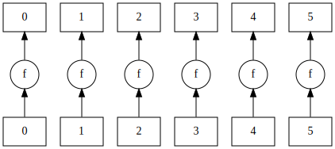
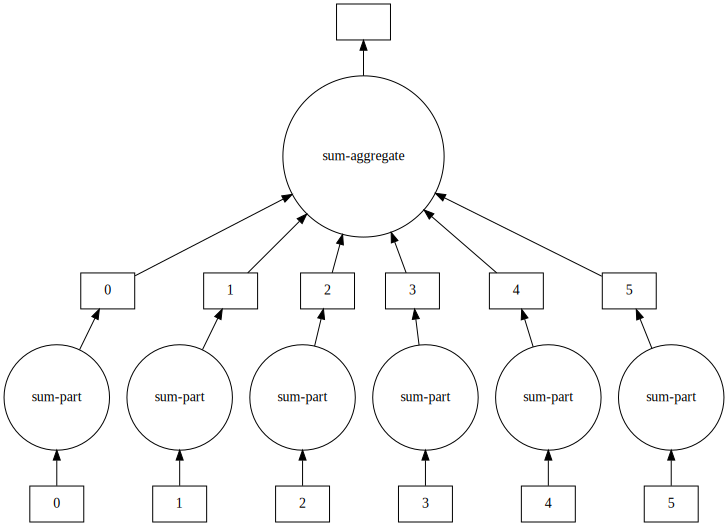

:::questions
- Which abstractions does Dask offer?
- Which programming patterns exist in the parallel universe?
:::

:::objectives
- Recognize `map`, `filter` and `reduction` patterns.
- Create programs using these building blocks.
- Use the `visualize` method to create dependency graphs.
:::

In computer science *bags* are unordered collections of data. In Dask, a `bag` is a collection that gets chunked internally. Operations on a bag are automatically parallelized over the chunks inside the bag.

Dask bags let you compose functionality using several primitive patterns: the most important of these are `map`, `filter`, `groupby`, `flatten`, and `reduction`.

:::discussion
## Discussion
Open the [Dask documentation on bags](https://docs.dask.org/en/latest/bag-api.html).
Discuss the `map`, `filter`, `flatten` and `reduction` methods.

In this set of operations `reduction` is rather special, because all operations on bags could be written in terms of a reduction.
:::

Operations on this level can be distinguished in several categories:

- **map** (N to N) applies a function *one-to-one* on a list of arguments. This operation is **embarrassingly
  parallel**.
- **filter** (N to &lt;N) selects a subset from the data.
- **reduction** (N to 1) computes an aggregate from a sequence of data; if the operation permits it
  (summing, maximizing, etc), this can be done in parallel by reducing chunks of data and then
  further processing the results of those chunks.
- **groupby** (1 bag to N bags) groups data in subcategories.
- **flatten** (N bags to 1 bag) combine many bags into one.

Let's see examples of them in action.

First, let's create the `bag` containing the elements we want to work with. In this case, the numbers from 0 to 5.

~~~python
import dask.bag as db

bag = db.from_sequence(['mary', 'had', 'a', 'little', 'lamb'])
~~~
{: .source}

### Map

A function squaring its argument is a mapping function that illustrates the concept of `map`:

~~~python
# Create a function for mapping
def f(x):
    return x.upper()

# Create the map and compute it
bag.map(f).compute()
~~~

~~~output
out: ['MARY', 'HAD', 'A', 'LITTLE', 'LAMB']
~~~

We can also visualize the mapping:

~~~python
# Visualize the map
bag.map(f).visualize()
~~~

{.output alt="boxes and arrows"}

### Filter

We need a predicate, that is a function returning either true or false, to illustrate the concept of `filter`.
In this case, we use a function returning `True` if the argument contains the letter 'a',
and `False` if it does not.

~~~python
# Return True if x contains the letter 'a', else False
def pred(x):
    return 'a' in x

bag.filter(pred).compute()
~~~

~~~output
[out]: ['mary', 'had', 'a', 'lamb']
~~~

:::challenge
## Difference between `filter` and `map`
Forecast the output of `bag.map(pred).compute()` without executing it. 

::::solution
## Solution
The output will be `[True, True, True, False, True]`.
::::
:::

### Reduction

~~~python
def count_chars(x):
    per_word = [len(w) for w in x]

    return sum(per_word)

bag.reduction(count_chars, sum).visualize()
~~~

{.output alt="boxes and arrows"}

:::challenge
## Challenge: consider `pluck`
We previously discussed some generic operations on bags. In the documentation, lookup the `pluck` method. How would you implement `pluck` if it was not there?

Hint: Try `pluck` on some example data.

```python
from dask import bag as db

data = [
   { "name": "John", "age": 42 },
   { "name": "Mary", "age": 35 },
   { "name": "Paul", "age": 78 },
   { "name": "Julia", "age": 10 }
]

bag = db.from_sequence(data)
...
```

::::solution
The `pluck` method is a mapping. The input is supposed to be a bag of dictionaries.

```python
from functools import partial
from operator import getitem
bag.map(partial(getitem, "name")).compute()
```
::::
:::

FIXME: find replacement for word counting example.

:::challenge
## Challenge: Dask version of Pi estimation
Use `map` and `mean` functions on Dask bags to compute $\pi$.

::::solution
## Solution

~~~python
import dask.bag
from numpy import repeat
import random

def calc_pi(N):
    """Computes the value of pi using N random samples."""
    M = 0
    for i in range(N):
        # take a sample
        x = random.uniform(-1, 1)
        y = random.uniform(-1, 1)
        if x*x + y*y < 1.:
            M += 1
    return 4 * M / N

bag = dask.bag.from_sequence(repeat(10**7, 24))
shots = bag.map(calc_pi)
estimate = shots.mean()
estimate.compute()
~~~
::::
:::

:::callout
## Note
By default Dask runs a bag using multiprocessing. This alleviates problems with the GIL, but also entails a larger overhead.
:::

:::keypoints
- Use abstractions to keep programs manageable.
:::

