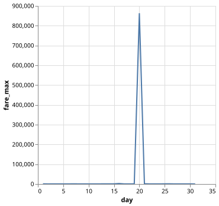
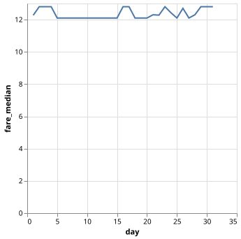
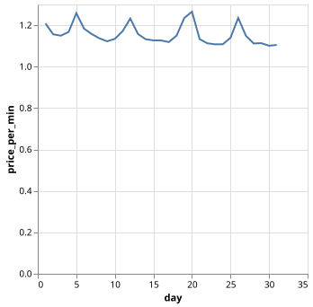
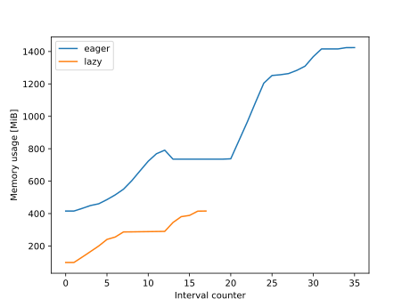
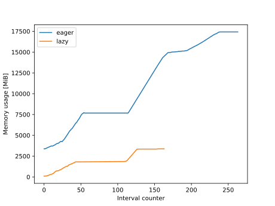

:::questions
- ToDo
:::

:::objectives
- ToDo
:::

# The New York Taxi dataset
This chapter focuses on working with data rather than parallel computation. For this we will make use of the [New York Taxi dataset](https://www.nyc.gov/site/tlc/about/tlc-trip-record-data.page), specifically the Yellow Taxi Trip Records of 2025.

:::callout
You can download the data yourself, or use the script provided in the `ny-taxi` folder of the `parallel-python-workshop` repository that you downloaded as part of the setup for this course.
:::

# Exploring the data
We will use [Polars](https://pola.rs/), a package for data manipulation. It has many similarities with [Pandas](https://pandas.pydata.org/), however one main difference is that Polars is able to process data in parallel which is why it is used for this lesson.

The data consist of one file per month in [Apache Parquet](https://parquet.apache.org/) format. Parquet is designed for efficient data storage and access. The actual data are stored in a column-oriented format, and compressed so they are not directly readable like text-oriented formats such as csv.

The whole taxi dataset is quite large, so we start by having a look at the data of a single month:

```python
import polars

data_jan = polars.read_parquet("ny-taxi/data/trip-data/yellow_tripdata_2025-01.parquet")
print(data.shape)
data_jan.head()
```

```output
(3475226, 20)

 shape: (5, 20)
VendorID	tpep_pickup_datetime	tpep_dropoff_datetime	passenger_count	trip_distance	RatecodeID	store_and_fwd_flag	PULocationID	DOLocationID	payment_type	fare_amount	extra	mta_tax	tip_amount	tolls_amount	improvement_surcharge	total_amount	congestion_surcharge	Airport_fee	cbd_congestion_fee
i32		datetime[us]		datetime[us]		i64		f64		i64		str			i32		i32		i64		f64		f64	f64	f64		f64		f64			f64		f64			f64		f64
1		2025-01-01 00:18:38	2025-01-01 00:26:59	1		1.6		1		"N"			229		237		1		10.0		3.5	0.5	3.0		0.0		1.0			18.0		2.5			0.0		0.0
1		2025-01-01 00:32:40	2025-01-01 00:35:13	1		0.5		1		"N"			236		237		1		5.1		3.5	0.5	2.02		0.0		1.0			12.12		2.5			0.0		0.0
1		2025-01-01 00:44:04	2025-01-01 00:46:01	1		0.6		1		"N"			141		141		1		5.1		3.5	0.5	2.0		0.0		1.0			12.1		2.5			0.0		0.0
2		2025-01-01 00:14:27	2025-01-01 00:20:01	3		0.52		1		"N"			244		244		2		7.2		1.0	0.5	0.0		0.0		1.0			9.7		0.0			0.0		0.0
2		2025-01-01 00:21:34	2025-01-01 00:25:06	3		0.66		1		"N"			244		116		2		5.8		1.0	0.5	0.0		0.0		1.0			8.3		0.0			0.0		0.0
```

There are quite a few columns to work with. For an explanation of the columns and their contents see \"Data Dictionaries and MetaData\" on the [dataset webpage](https://www.nyc.gov/site/tlc/about/tlc-trip-record-data.page).

# Grouping and aggregating
Let\'s say we want to know the highest fare on each day of the month. There is no column that describes just the day of the month, only the exact pickup time as a datetime object. Polars provides tools to work with datetime objects. We will use these to create an _expression_ that describes how to obtain the day of the month from the `tpep_pickup_datetime` column:

```python
day_expr = polars.col("tpep_pickup_datetime").dt.day().alias("day")
```

This tells Polars that:

1. There is a column named `tpep_pickup_datetime`
2. This is a datetime object
3. Extract the day
4. Rename the new column to `day`

:::callout
We did not access the actual dataset when creating this expression. We could even have done this before loading any data at all.
An expression only describes _how_ to process the data, without actually _executing_ it.
Polars also supports Pandas-like syntax (`data["column_name"]`), however this requires loading the dataset first.
:::

Next, we will create another expession to obtain the highest fare from the `fare_amount` column:

```python
fare_max_expr = polars.col("fare_amount").max().alias("fare_max")
```

Finally, we can apply these expressions to the data. We first group the data by day of the month, then we aggregate on the max fare. Finally, we sort the output by the day of the month column:

```python
result = data_jan.group_by(day_expr).agg(fare_max_expr).sort("day")
```

Polars has some builtin plotting tools. A line plot can be created like this:
```python
result.plot.line("day", "fare_max")
```



This does not tell us much, there is an extreme outlier with a fare of over $800000 dollars! In real data, you should always check for outliers and issues in the data. For now we will simplify this by looking at the _median_ fare. Change the fare expression to use the median, and create a new plot:

```
python
fare_median_expr = polars.col("fare_amount").median().alias("fare_median")
result = data_jan.group_by(day_expr).agg(fare_median_expr).sort("day")
result.plot.line("day", "fare_median")
```



:::callout
## Saving plots
Polars uses the Altair package for plotting, see [here](https://docs.pola.rs/api/python/stable/reference/dataframe/plot.html). `df.plot.line("foo", "bar")` is an alias for `altair.Chart(df).mark_line(tooltip=True).encode(x="foo", y="bar").interactive()`. To save a figure, use the `.save("filename")` method in place of `.interactive()`.
:::


:::challenge
## Median trip distance per hour
Create a plot showing the median trip distance at each hour of the day, averaged over the entire month.

::::solution
```python
hour_expr = polars.col("tpep_pickup_datetime").dt.hour().alias("hour")
dist_expr = polars.col("trip_distance").median().alias("trip_distance_median")
result = data_jan.group_by(hour_expr).agg(dist_expr).sort("hour")
result.plot.line("hour", "trip_distance_median")
```
::::
:::

# Arithmetic and filtering
Polars expressions can be combined to create much more complex workflows. As an example, we will compute the cost of a taxi trip in dollars per minute for all trips in the January data. The cost of the trip is already in the dataset, but we need to create our own expression to compute the trip duration in minutes. For this we combine the pickup and dropoff time columns.

```python
trip_duration_expr = (polars.col("tpep_dropoff_datetime") - polars.col("tpep_pickup_datetime")).dt.total_minutes(fractional=True)
data.select(trip_duration_expr)
```

```output
shape: (3_475_226, 1)
tpep_dropoff_datetime
f64
8.35
2.55
1.95
5.566667
3.533333
...
14.683333
26.966667
16.033333
20.3
10.75
```

:::callout
## Column naming
Note that if you do not specify an alias for an expression, the first column name in the expression is reused.
:::

We can divide the fare mount by the trip duration expression to obtain our desired result, and look at some statistics.

```python
price_per_min_expr = (polars.col("fare_amount") / trip_duration_expr).alias("price_per_min")
result = data.select(price_per_min_expr)["price_per_min"]

result.min(), result.mean(), result.max()
```

```output
(-inf, nan, inf)
```

:::discussion
Where do these non-finite values come from? The trip duration is sometimes zero, and diving by zero results in an infinite price per minute. Some fare amounts are actually negative, resulting in minus infinity. The mean of an array including infinities cannot be computed and results in NaN (not a number).
:::

We can introduce a filter to select only the finite values.

```python
result_finite = result.filter(result.is_finite())

result_finite.min(), result_finite.mean(), result_finite.max()
```

```output
(-10500.0, 3.2354157502472707, 159883.72592592592)
```

There are still clearly wrong values in the data. How you want to filter these out would depend a lot on your dataset and use case.

Now, let\'s look at the price per minute grouped per day of the month as we did before. First, we build the expression in the same way as before to illustrate the problem.

```python
price_per_min_mean_expr = (polars.col("fare_amount") / trip_duration_expr).mean().alias("price_per_min")
data_jan.group_by(day_expr).agg(price_per_min_expr).sort("day")
```

```output
shape: (31, 2)
day	price_per_min
i8	f64
1	NaN
2	NaN
3	NaN
4	inf
5	inf
...	...
27	NaN
28	inf
29	inf
30	NaN
31	NaN
```

Here we once again see the NaN and inf values. These already appear when calling `mean`, if we would filter out the non-finite values as a last step, there would be nothing left. Instead, we have to filter by finite values _before_ taking the mean. We can do this by building up our expression in multiple steps. We can also switch to the median again to avoid outliers.

```python
ppm_expr = polars.col("fare_amount") / trip_duration_expr
ppm_finite_expr = ppm_expr.filter(ppm_expr.is_finite()).median().alias("price_per_min")

result = data_jan.group_by(day_expr).agg(ppm_finite_expr).sort("day")
result
```

```output
shape: (31, 2)
day	price_per_min
i8	f64
1	1.208481
2	1.156069
3	1.149425
4	1.167421
5	1.258065
...	...
27	1.148936
28	1.11194
29	1.1133
30	1.100917
31	1.104876
```

:::challenge
## Analyze the pricing
Make a plot. Investigate the pricing outliers: what is special about these days?

::::solution
```python
result.plot.line("day", "price_per_min")
```



There is a clear increase in price on the 5th, 12th, 19th, and 26th: These are sundays. There is another peak on the 20th, which happens to be the presidential inauguration day.
::::
:::

# Parallelization in Polars
Polars has been using multiple threads to process the data all along. The number of threads used by Polars can be obtains as follows.

```python
polars.thread_pool_size()
```

```output
10
```

There is no function to the number of threads. Instead, this can be done through an _environment variable_. In Linux, this is typically done when launching a script through the terminal, e.g. `ENV_VAR=value python script_name.py`. In Python, you can also set them using the `os` module.

:::callout
Polars reads its environment variable when you import it. Setting it when Polars is already imported has no effect. When using Jupyter Lab or similar, restart the kernel before executing the following code block.
:::

```python
import os
os.environ["POLARS_MAX_THREADS"] = "1"
import polars
polars.thread_pool_size()
```

```output
1
```

:::discussion
## Discussion
How much speedup do you get on the price per minute calculation with parallelization enabled vs disabled? What happens when you manually increase the number of threads beyond the default? The speedup depends not only on the CPU but also I/O performance. At some point addin more threads does not give more performance.
:::


Before continuing, set the thread pool size back to the default by restarting the jupyter kernel and importing polars _without_ changing `os.environ`.

```python
import polars
polars.thread_pool_size()
```

```output
10
```

# Eager and Lazy processing
Polars supports _lazy_ loading of data. In this mode, it only scans a dataset\'s metadata. This allows Polars to work on datasets that are very large, and might not even fit in your computer\'s memory. The opposite of lazy loading is _eager_ loading, which is what we have done so far with the `read_parquet` function. 

Before we get further into lazy loading, we will do some profiling in eager mode so we can assess the difference with lazy mode later.

```python
def process(data):
    day_expr = polars.col("tpep_pickup_datetime").dt.day().alias("day")
    trip_duration_expr = (polars.col("tpep_dropoff_datetime") - polars.col("tpep_pickup_datetime")).dt.total_minutes(fractional=True)
    ppm_expr = polars.col("fare_amount") / trip_duration_expr
    ppm_finite_expr = ppm_expr.filter(ppm_expr.is_finite()).median().alias("price_per_min")

    return data.group_by(day_expr).agg(ppm_finite_expr).sort("day")

%timeit data = polars.read_parquet("ny-taxi/data/trip-data/yellow_tripdata_2025-01.parquet")
%timeit process(data)
```

```output
57.1 ms ± 4.29 ms per loop (mean ± std. dev. of 7 runs, 10 loops each)
157 ms ± 10.5 ms per loop (mean ± std. dev. of 7 runs, 1 loop each)
```

Now we can do the same for the lazy loading mode. Lazily loading data is done with the `scan_parquet` function.

```python
data_lazy = polars.scan_parquet("ny-taxi/data/trip-data/yellow_tripdata_2025-01.parquet")
process(data_lazy)
```

```output
naive plan: (run LazyFrame.explain(optimized=True) to see the optimized plan)

SORT BY [col("day")]

AGGREGATE[maintain_order: false]

[[(col("fare_amount")) / ([(col("tpep_dropoff_datetime")) - (col("tpep_pickup_datetime"))].dt.total_minutes())].filter([(col("fare_amount")) / ([(col("tpep_dropoff_datetime")) - (col("tpep_pickup_datetime"))].dt.total_minutes())].is_finite()).median().alias("price_per_min")] BY [col("tpep_pickup_datetime").dt.day().alias("day")]

FROM

Parquet SCAN [ny-taxi/data/trip-data/yellow_tripdata_2025-01.parquet]

PROJECT */20 COLUMNS

ESTIMATED ROWS: 347522
```

Instead of the output, we see Polar\'s plan on how to obtain it. This is very similar to how e.g. Dask.delayed functions. In order to execute the commands, the `collect` method is used.

```python
result = process(data_lazy)
result.collec()
```

Let\'s time the lazy data loading and processing.

```python
%timeit data_lazy = polars.scan_parquet("ny-taxi/data/trip-data/yellow_tripdata_2025-01.parquet")
%timeit process(data_lazy).collect()
```

```output
6.5 us ± 130 ns per loop (mean ± std. dev. of 7 runs, 100,000 loops each)
164 ms ± 12.5 ms per loop (mean ± std. dev. of 7 runs, 10 loops each)
```

Not only is scanning the dataset near-instant, the actual processing is faster too, from a total of ~214 ms to ~164 ms.

:::discussion
Why is the overall processing time be lower than in the eager case? With lazy processing, only the data that are actually needed are loaded from disk. Most columns are not used in this example, and are never loaded.
:::


:::challenge
## Lazy vs eager memory use
Use the memory profiler to investigate the difference in memory use between the lazy and eager evaluation mode.

Important: due to some quirks in the memory profiler, it can only measure the memory usage properly _once_. If you need to run it again, first restart the Jupyter kernel. For similar reasons, ensure you _first_ profile the lazy processing version, and only then the eager one.

Hint: Put the eager and lazy workflow in a function. Remember that the memory profiler can be used as follows to obtain data and create a plot:
```python
from memory_profiler import memory_usage

memory = memory_usage(function_name, interval=.01)
plt.plot(memory)
plt.xlabel('Interval counter')
plt.ylabel('Memory usage [MiB]')
plt.show()
```

::::solution
```python
import polars
from memory_profiler import memory_usage

trip_duration_expr = (polars.col("tpep_dropoff_datetime") - polars.col("tpep_pickup_datetime")).dt.total_minutes(fractional=True)
day_expr = polars.col("tpep_pickup_datetime").dt.day().alias("day")
ppm_expr = polars.col("fare_amount") / trip_duration_expr
ppm_finite_expr = ppm_expr.filter(ppm_expr.is_finite()).median().alias("price_per_min")

def workflow_eager():
    data = polars.read_parquet("ny-taxi/data/trip-data/yellow_tripdata_2025-01.parquet")
    return data.group_by(day_expr).agg(ppm_finite_expr).sort("day")

def workflow_lazy():
    data = polars.scan_parquet("ny-taxi/data/trip-data/yellow_tripdata_2025-01.parquet")
    return data.group_by(day_expr).agg(ppm_finite_expr).sort("day").collect()

memory_lazy = memory_usage(workflow_lazy, interval=.01)
memory_eager = memory_usage(workflow_eager, interval=.01)

import matplotlib.pyplot as plt
plt.plot(memory_eager, label='eager')
plt.plot(memory_lazy, label='lazy')
plt.xlabel('Interval counter')
plt.ylabel('Memory usage [MiB]')
plt.legend()
plt.show()
```



The lazy mode uses ~4 times less memory than the eager mode.
::::
:::

The lazy mode allows us to work on datasets that are too big in memory. Even if the data required for the computation is too big, it will stil work because Polars automatically chunks the data. Consider the same price per minute calculation, but aggregrated over each month of the year, instead of each day of January. We can again run the lazy and eager workflows. Warning: The eager mode requires a machine with >= 32 GB RAM. On machines with less memory, use e.g. just the first 6 months of data. This can be done by giving a list of input files to the `read_parquet` / `scan_parquet` functions, or by providing a wildcard like this: `"ny-taxi/data/trip-data/yellow_tripdata_2025-0[1-6].parquet"`.


```python
month_expr = polars.col("tpep_pickup_datetime").dt.month().alias("month")

def workflow_lazy_by_month():
    data = polars.scan_parquet("ny-taxi/data/trip-data/*.parquet")
    return data.group_by(month_expr).agg(ppm_finite_expr).sort("month").collect()

# Warning: Only inlude the full eager workflow on a machine with >= 32GB RAM
def workflow_eager_by_month():
    data = polars.read_parquet("ny-taxi/data/trip-data/*.parquet")
    return data.group_by(month_expr).agg(ppm_finite_expr).sort("month")

memory_lazy = memory_usage(workflow_lazy_by_month, interval=.01)
memory_eager = memory_usage(workflow_eager_by_month, interval=.01)

import matplotlib.pyplot as plt
plt.plot(memory_eager, label='eager')
plt.plot(memory_lazy, label='lazy')
plt.xlabel('Interval counter')
plt.ylabel('Memory usage [MiB]')
plt.legend()
plt.show()
```



:::keypoints
- Polars is similar in usage to Pandas, but usually offers superior performance
- I/O performance can be an important factor in paralellization
:::